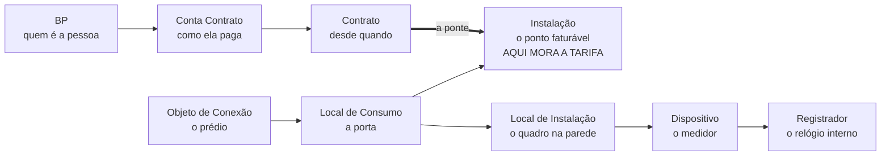

# O NÚCLEO
### SAP for Utilities: o mapa que você precisa ter na cabeça

---

## REVISÃO DE 2 MINUTOS

> **Abra isto todo dia.** Sem explicação, só recall.
> A explicação está no resto do arquivo, e você lê duas ou três vezes no total.

### A hierarquia

### Os cinco atos, e o que cada um deixa pronto

| Ato | Caixas | Módulos | O produto |
|---|---|---|---|
| 1. O cliente entra | 1 e 2 | CRM, Move-In/Out | **Contrato ativo** |
| 2. O consumo é capturado | 3 e 4 | DM, Meter Reading | **Resultado de leitura válido** |
| 3. O consumo vira valor | 5 e 6 | Billing, Invoicing | **A conta e a dívida** |
| 4. O dinheiro entra, ou não | 7 e 8 | FI-CA, WM | **Partida compensada** |
| 5. Tudo vira número | 9 | BW | **Indicador** |

### As cinco distinções que caem em prova

1. **Local de Consumo** é o espaço. **Instalação** é o serviço faturável nele.
2. A **Instalação** é do imóvel. O **Contrato** é da pessoa.
3. **Billing** calcula. **Invoicing** emite a conta **e cria a dívida**.
4. **FI-CA** é razão auxiliar. Manda **totais** para o **FI**.
5. **Dunning** decide e manda. **WM** executa o corte.

### A pegadinha do medidor

Instalar dispositivo tem **duas partes**. A **técnica** diz onde ele está. A de **faturamento** liga o registrador à tarifa. Sem a segunda, a instalação nunca fatura.

### O fluxo em uma frase

> **Cadastra → move-in → instala medidor → lê → calcula → emite a conta → cobra → corta se não pagar → reporta.**

---
---

## Como usar este material

**Este arquivo é o hub.** Ele tem o cartão de 2 minutos acima e o mapa abaixo.
Nada mais mora aqui.

| Quando | Onde ir | Frequência |
|---|---|---|
| Revisar rápido | O cartão acima | **todo dia, 2 min** |
| Estudar um tema | [`notas/_INDICE.md`](notas/_INDICE.md) | semanal |
| Saber em que ordem estudar | [`notas/_DEPENDENCIAS.md`](notas/_DEPENDENCIAS.md) | ao começar |
| Achar transação ou tabela | [`02-BANCADA.md`](02-BANCADA.md) | sob demanda |
| Detalhar FI-CA | [`FI-CA-detalhado.md`](FI-CA-detalhado.md) | sob demanda |

---

## As 15 notas

**Geral**
[`GE-03` A concessionária](notas/GE-03-a-concessionaria.md) ·
[`GE-01` O que é o IS-U CCS](notas/GE-01-o-que-e-is-u-ccs.md) ·
[`GE-02` Evolução do produto](notas/GE-02-evolucao-do-produto.md) ·
[`GE-04` Os três setores](notas/GE-04-os-tres-setores.md)

**Dados mestres comerciais**
[`MD-01` O mapa](notas/MD-01-mapa-dos-dados-mestres.md) ·
[`MD-02` A tradução do prédio](notas/MD-02-a-traducao-do-predio.md) ·
[`MD-03` Parceiro de Negócios](notas/MD-03-parceiro-de-negocios.md) ·
[`MD-04` PN, dados](notas/MD-04-parceiro-de-negocios-dados.md) ·
[`MD-05` Conta Contrato](notas/MD-05-conta-contrato.md) ·
[`MD-06` Contrato](notas/MD-06-contrato.md) ·
[`MD-07` Move-In e Move-Out](notas/MD-07-move-in-move-out.md)

**Dados mestres técnicos**
[`ST-01` Objeto de Ligação](notas/ST-01-objeto-de-ligacao.md) ·
[`ST-02` Local de Consumo](notas/ST-02-local-de-consumo.md) ·
[`ST-03` Instalação](notas/ST-03-instalacao.md) ·
[`ST-04` Equipamento](notas/ST-04-equipamento.md)

---

## O que não está aqui, e onde foi parar

| Conteúdo | Foi para |
|---|---|
| A concessionária em 5 parágrafos | nota [`GE-03`](notas/GE-03-a-concessionaria.md) |
| O que é o SAP for Utilities | nota [`GE-01`](notas/GE-01-o-que-e-is-u-ccs.md) |
| Os três setores | nota [`GE-04`](notas/GE-04-os-tres-setores.md) |
| A hierarquia, camada por camada | notas [`MD-02`](notas/MD-02-a-traducao-do-predio.md) e `ST-01` a `ST-04` |
| A Dona Marta, o prédio | dentro de [`MD-02`](notas/MD-02-a-traducao-do-predio.md) |
