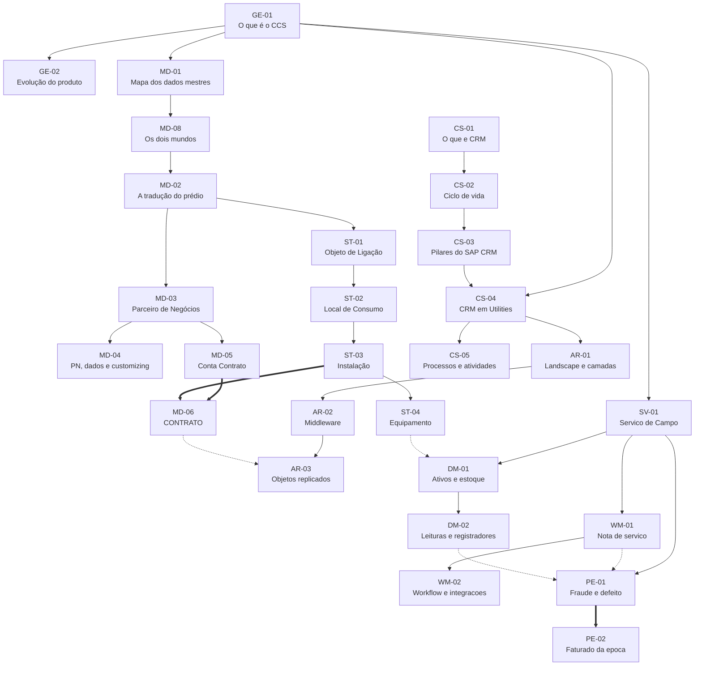

# SAP IS-U CCS, referência em português

Notas sobre **SAP IS-U CCS** (*Industry Solutions for Utilities / Customer Care
Service*), a solução setorial que roda o ciclo comercial de concessionárias de
energia, água e gás.

Quase não existe material estruturado de IS-U em português. Este repositório é
uma tentativa de mudar isso, em aberto, com correção de quem conhece o módulo
na prática.

**Por onde entrar, conforme o tempo que você tem:**

| Tempo | O quê |
|---|---|
| **4 minutos** | A tabela abaixo, de cima para baixo. É o acervo inteiro resumido |
| **6 minutos** | A [`MD‑02`](notas/07-MD-02-a-traducao-do-predio.md), que traduz um prédio de verdade nos objetos do sistema |
| **Uma sessão** | [`_PISTAS.md`](notas/_PISTAS.md), as 131 perguntas, respondendo em voz alta |
| **Três horas** | As 31 notas, na ordem da pasta |

---

# As 31 notas

**O número na frente do arquivo é a ordem de estudo.** Abra a pasta
[`notas/`](notas/) e leia de cima para baixo: nenhuma nota depende de uma que
venha depois dela. A tabela é a mesma ordem.

<!-- INICIO NOTAS -->

### Fundacao

Valem para qualquer trilha. A ordem e a ordem: cada uma usa a anterior.

| # | Nota | O que e | Origem |
|---|---|---|---|
| **01** | [`GE-03` Do problema ao módulo](notas/01-GE-03-do-problema-ao-modulo.md) | Cinco parágrafos de negócio, e o mapa de qual pedaço do CCS resolve cada um. Leia antes de qualquer sigla: é o "por quê" de todas elas. | meu |
| **02** | [`GE-01` O que é o SAP IS-U CCS](notas/02-GE-01-o-que-e-is-u-ccs.md) | O conjunto de módulos que roda o ciclo comercial de uma concessionária, do cadastro do cliente até o dinheiro entrar. | slide |
| **03** | [`GE-02` A evolução do produto, do R/3 ao SaaS](notas/03-GE-02-evolucao-do-produto.md) | Trinta e cinco anos em cinco marcos, e por que 2027 é a data que move o mercado inteiro. | slide |
| **04** | [`GE-04` Os três setores, com peso igual](notas/04-GE-04-os-tres-setores.md) | Energia, gás e saneamento rodam o mesmo núcleo. A diferença aparece em pontos específicos, e um exercício pode vir de qualquer um deles. | misto |
| **05** | [`MD-01` As quatro divisões dos dados mestres](notas/05-MD-01-mapa-dos-dados-mestres.md) | Antes de comparar qualquer coisa, saber o que é cada uma. São quatro divisões, não duas, e a quarta não é dado mestre. | slide |
| **06** | [`MD-08` Os dois mundos e a validade no tempo](notas/06-MD-08-os-dois-mundos.md) | O desenho que arruma comercial e técnico lado a lado, a ponte entre eles, e a armadilha de achar que a ordem do desenho é a hierarquia. | slide |
| **07** | [`MD-02` A tradução do prédio](notas/07-MD-02-a-traducao-do-predio.md) | O diagrama que converte o mundo real inteiro em vocabulário SAP, de uma vez. | slide |
| **08** | [`MD-03` Parceiro de Negócios, categoria e função](notas/08-MD-03-parceiro-de-negocios.md) | Quem é a pessoa, e qual papel ela cumpre. São duas perguntas diferentes, e o SAP guarda as duas em campos diferentes. | slide |
| **09** | [`MD-04` Parceiro de Negócios, os dados e o customizing](notas/09-MD-04-parceiro-de-negocios-dados.md) | O que cabe dentro da ficha do cliente, e onde se desenha a ficha. | slide |
| **10** | [`MD-05` Conta Contrato](notas/10-MD-05-conta-contrato.md) | A bolsa financeira do cliente. Reúne débitos e créditos, e é onde moram as regras de pagamento e de cobrança. | slide |
| **11** | [`ST-01` Objeto de Ligação](notas/11-ST-01-objeto-de-ligacao.md) | A edificação conectada à rede. O nível mais alto dos dados mestres técnicos, e onde mora o endereço. | slide |
| **12** | [`ST-02` Local de Consumo](notas/12-ST-02-local-de-consumo.md) | A unidade que recebe energia e é medida separadamente. O apartamento dentro do prédio. | slide |
| **13** | [`ST-03` Instalação](notas/13-ST-03-instalacao.md) | O objeto que efetivamente fatura. É aqui que moram a tarifa, a unidade de leitura e as regras de cálculo. | slide |
| **14** | [`ST-04` Equipamento e Local de Instalação](notas/14-ST-04-equipamento.md) | O aparelho físico e o lugar onde ele está parafusado. E as três formas de instalar, que explicam um chamado clássico. | misto |
| **15** | [`MD-06` Contrato](notas/15-MD-06-contrato.md) | A dobradiça do sistema. É o único objeto que toca o mundo comercial e o mundo técnico ao mesmo tempo. | slide |
| **16** | [`MD-07` Move-In e Move-Out](notas/16-MD-07-move-in-move-out.md) | O processo que cria e encerra o Contrato. | meu |

### Atendimento e relacionamento (CRM)

| # | Nota | O que e | Origem |
|---|---|---|---|
| **17** | [`CS-01` O que é CRM](notas/17-CS-01-o-que-e-crm.md) | A disciplina antes do produto. CRM é um jeito de organizar o relacionamento com o cliente, e só depois um sistema da SAP. | slide |
| **18** | [`CS-02` Ciclo de vida do cliente](notas/18-CS-02-ciclo-de-vida-do-cliente.md) | Seis etapas de um lado, três pilares do outro. São a mesma coisa vista de perto e de longe, e vale enxergar as duas juntas. | slide |
| **19** | [`CS-03` SAP CRM e os três pilares](notas/19-CS-03-sap-crm-e-os-pilares.md) | O produto. Marketing, Vendas e Serviço, cada um com sua fileira de módulos. E o nome novo que a SAP deu a tudo isso dentro do S/4HANA. | slide |
| **20** | [`CS-04` CRM no contexto Utilities](notas/20-CS-04-crm-no-contexto-utilities.md) | Onde exatamente o CRM se encaixa na cadeia que você já conhece. Ele é a primeira área, a porta por onde tudo entra. | slide |
| **21** | [`CS-05` Processos e atividades no atendimento](notas/21-CS-05-processos-e-atividades.md) | O que o atendente realmente faz o dia inteiro. Protocolo, atividade e a lista de processos que respondem por quase todo o volume de um call center de concessionária. | slide |

### Arquitetura e integracao

| # | Nota | O que e | Origem |
|---|---|---|---|
| **22** | [`AR-01` O landscape e as cinco camadas](notas/22-AR-01-landscape-e-camadas.md) | Dois desenhos da mesma coisa. Um simples, para entender; um detalhado, para se localizar. Comece pelo simples. | slide |
| **23** | [`AR-02` Middleware e replicação](notas/23-AR-02-middleware-e-replicacao.md) | Como um dado criado no CRM aparece no IS-U. Um caminho de cinco paradas, e as transações para olhar cada uma quando ele trava. | slide |
| **24** | [`AR-03` Objetos replicados](notas/24-AR-03-objetos-replicados.md) | Quatro objetos existem dos dois lados com nomes e tabelas diferentes. Este de-para é o que você consulta quando alguém diz "o dado está divergente". | slide |

### Servico de Campo (SVC)

| # | Nota | O que e | Origem |
|---|---|---|---|
| **25** | [`SV-01` Serviço de Campo (SVC) e os três blocos](notas/25-SV-01-servico-de-campo.md) | A área tem quatro nomes circulando e três blocos por dentro. Acertar o vocabulário aqui evita meia hora de conversa errada numa reunião. | misto |
| **26** | [`WM-01` A nota de serviço e o ciclo do campo](notas/26-WM-01-nota-de-servico.md) | Tudo que o campo faz começa numa nota de serviço. Ela carrega tipo, motivo, prioridade e prazo, e é o prazo que dá multa. | misto |
| **27** | [`WM-02` Workflow e as quatro integrações do campo](notas/27-WM-02-workflow-e-integracoes.md) | O campo quase nunca decide sozinho o que fazer. O pedido chega de fora e anda sozinho por dentro. Este é o mapa de quem manda e de quem executa. | misto |
| **28** | [`DM-01` Ativos, movimentação e estoque](notas/28-DM-01-ativos-e-estoque.md) | O medidor tem uma vida inteira antes e depois de estar na parede. Device Management é quem sabe onde cada um está, e onde esteve. | misto |
| **29** | [`DM-02` Leituras e registradores](notas/29-DM-02-leituras-e-registradores.md) | Seis tipos de leitura, cinco motivos e seis registradores. Parece lista de decorar, e não é: cada eixo responde uma pergunta diferente da investigação. | misto |
| **30** | [`PE-01` Gestão de Perdas, fraude e defeito](notas/30-PE-01-fraude-e-defeito.md) | A mesma consequência, dois mundos jurídicos diferentes. Classificar errado aqui é o erro que vira processo. | misto |
| **31** | [`PE-02` Faturado da época x fatura revista](notas/31-PE-02-faturado-da-epoca.md) | O cálculo que transforma uma irregularidade em valor a cobrar. Duas contas do mesmo período, e a diferença entre elas é a receita recuperada. | misto |
<!-- FIM NOTAS -->

**Cerca de 185 minutos no total.** A coluna *O que é* é o resumo da própria
nota, gerado a partir dela, então nunca diverge.

---

# Por que esta ordem

`MD‑06`, o Contrato, é o único conceito que **exige os dois ramos completos**:
precisa da Conta Contrato do lado comercial e da Instalação do lado técnico.
Por isso ele é a nota **15**, e não a sexta dos dados mestres comerciais.

Três consequências:

1. **É por isso que ele costuma ser ensinado por último.** Não dá para ensinar antes
2. **É por isso que ele é o mais difícil.** Exige tudo o que veio antes
3. **É por isso que ele é o que mais cai.** É onde o entendimento se prova

Se você entende o Contrato de verdade, entende os dados mestres inteiros. Se
não entende, o problema está em algum nó acima dele, não nele.

**As áreas, 17 a 31, são independentes entre si.** Depois de escolher uma
trilha, só uma delas continua valendo leitura profunda.

---

# De onde vem cada nota

Nada aqui pede confiança cega. A coluna *Origem* diz o grau:

| Origem | Significa | Quantas |
|---|---|---|
| **slide** | O material da academia sustenta a nota inteira | 20 |
| **misto** | As listas e os nomes são do material. **O raciocínio em volta é meu** | 9 |
| **meu** | O material dá o gancho, o desenvolvimento é meu. **Confirme antes de repetir** | 2 |
| **`⟨confirmar⟩`** no texto | Código ou nome de tabela de que não tenho certeza | |

A regra que sustenta isso está em [`PADRAO.md`](PADRAO.md): **conteúdo não
confirmado nunca ocupa posição estrutural.** Ele não vira item de lista
numerada nem linha de tabela de taxonomia, porque a posição afirma mais que o
rótulo. Essa regra nasceu de um erro real, documentado em
[`EM-ABERTO.md`](EM-ABERTO.md).

---

# Material de apoio

| Arquivo | Para quê |
|---|---|
| [`notas/_PISTAS.md`](notas/_PISTAS.md) | As 131 perguntas em fila, para testar tudo. Gerado |
| [`notas/_GABARITOS.md`](notas/_GABARITOS.md) | As respostas, separadas de propósito |
| [`referencia/02-BANCADA.md`](referencia/02-BANCADA.md) | Transações, tabelas e caminhos de menu. É consulta, use `Ctrl+F` |
| [`EM-ABERTO.md`](EM-ABERTO.md) | O que o material nomeia e não explica, e quem pode fechar |
| [`PADRAO.md`](PADRAO.md) | A forma da nota, para quem for escrever uma |

Depois de editar uma nota, rode `python ferramentas/gera.py`: ele regenera a
tabela acima e as pistas.

---

# Como contribuir

**Todo `⟨confirmar⟩` é um convite.** Se você roda IS-U em produção, sua
resposta vale mais que uma semana de leitura minha.

- **[Corrigir conteúdo](../../issues/new?template=correcao-de-conteudo.yml)**,
  quando algo está errado, incompleto ou confuso
- **[Confirmar transação](../../issues/new?template=confirmar-transacao.yml)**,
  quando você sabe um código marcado como duvidoso
- **[Ver o que está aberto](../../issues)**, se quiser pegar algo pronto
- [`CONTRIBUTING.md`](CONTRIBUTING.md) para o resto

Se você leu uma nota e não entendeu, **a nota está mal escrita**. Isso também
vale issue, e é o defeito que eu não consigo enxergar sozinho.

---

Trabalho independente, sem vínculo com a SAP nem com qualquer empregador.
SAP, SAP IS-U e S/4HANA são marcas da SAP SE. Nada aqui reproduz material de
treinamento proprietário, e este repositório não é fonte oficial: para decisão
de projeto, consulte a documentação da SAP.
