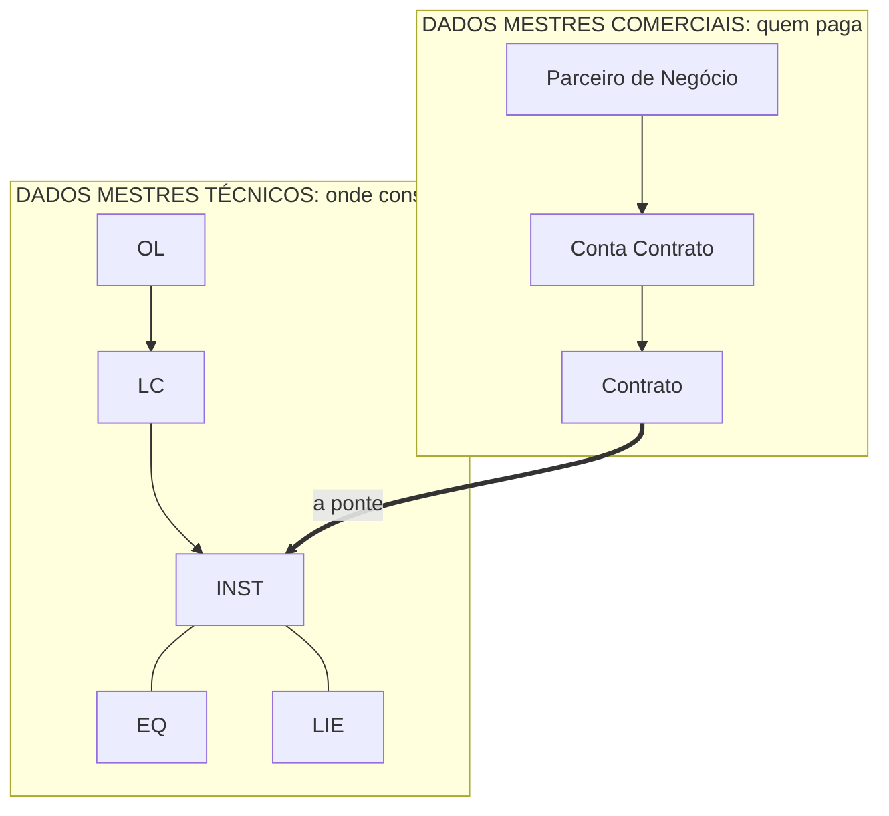

# AUDITORIA DE FONTES PARA NOTEBOOKLM
### O que neste acervo degrada quando ele deixa de ser lido e passa a ser recuperado

> Passe diagnóstico de 23/08/2026. Linha de base:
> `python ferramentas/audita.py`, que reporta 42 notas, 364 pistas, cobertura de
> código 100%, zero zonas ausentes pelo critério dele.
> **Este relatório começa onde o script para.**

---

## ESTADO DAS CORREÇÕES

**A triagem de duas horas foi aplicada em 23/08/2026.** O diagnóstico abaixo
fica intacto como registro do que foi encontrado. Esta tabela diz o que já não
é verdade.

| Achado | Estado | O que foi feito |
|---|---|---|
| **A-01** | **Corrigido** | `gera.py --caderno` escreve `caderno/` com a resposta colada em cada pergunta. **367 de 367 respondidas no próprio arquivo**, incluindo as três novas da `MD-01`. O `_PISTAS.md` não sobe, e a duplicação some junto |
| **A-02** | **Corrigido** | Arquivo renomeado para `04-GE-04-os-quatro-mercados.md`. Referências atualizadas no `_PISTAS`, no README e no `gera.py`, inclusive o título do gabarito, que dizia "Os três setores" |
| **A-03** | **Corrigido** | Campo `**Origem:**` presente nas **42 de 42** notas. 35 novos, 3 rótulos `Status:` renomeados, 4 já tinham |
| **A-04** | **Resolvido por decisão** | `podcasts/` não sobe |
| **A-05** | **Corrigido** | Os três arquivos passam a contar a mesma história. As nove tabelas de endereço entraram na `MD-01` seção 1, com a proveniência declarada (pôster, não slide) e a leitura marcada como do autor. `EM-ABERTO` mudou de "nunca desenvolvida" para **parcialmente coberta** nas duas linhas, e a Bancada aponta de volta para a nota. Três pistas novas na `MD-01` |
| **A-06** | **Corrigido, e a classe inteira fechada** | Os quatro números do README e o do `_PISTAS` **passaram a ser gerados**: `gera.py` reescreve a prosa a cada rodada, a partir de `MINUTOS_POR_NOTA` e da contagem real. `PADRAO` e `CONTRIBUTING` foram reescritos no passado com a data da medição, porque ali o número é diagnóstico histórico e não estado atual |
| **A-07** | **Resolvido por decisão** | `podcasts/` não sobe |
| **A-08** | **Corrigido** | Seção nova na `BI-01`: *"A palavra Faturamento nomeia duas coisas diferentes"*, com a tabela de três usos e a regra prática |
| **A-09** | **Corrigido** | **Zero blocos mermaid no caderno.** Os 12 das notas viraram figura de texto no estilo que a `BI-01` já usava, e a `MD-08` deixou de falar em "a seta grossa". Efeito colateral bom: o mermaid distorcia `S/4HANA` em `S-4HANA` e `R/3` em `R-3`, porque a barra quebra a sintaxe; em texto os nomes voltaram ao certo. **Correção do próprio diagnóstico:** eram **15** blocos, não 12. Os outros três estão na Bancada, dentro das seções de meta-estudo, e a poda de A-11 já os remove do caderno. No `referencia/` eles ficam, porque o GitHub renderiza mermaid e ali isso é vantagem |
| **A-10** | **Resolvido por decisão** | `EM-ABERTO`, `PADRAO`, `CONTRIBUTING`, `README`, `ferramentas/`, `.github/` e `_privado/` não sobem |
| **A-11** | **Corrigido na origem** | A poda no gerador foi a primeira solução. Em 23/08/2026 o problema foi resolvido na fonte: o checklist e a árvore de diagnóstico viraram a nota [`BI-05`](../notas/43-BI-05-o-que-precisa-para-faturar.md), as expectativas de prova foram para [`PREPARACAO.md`](PREPARACAO.md), e as armadilhas já tinham dono nas notas em 14 dos 19 casos. **A Bancada caiu de 709 para 563 linhas e ficou só com consulta e os dois roteiros de exercício**, e virou `notas/_BANCADA.md`, ao lado das notas que ela serve. `PODA_BANCADA` está vazia, e o mecanismo fica de pé para o caso de meta-estudo voltar |
| **A-12** | **Corrigido** | `FOP` marcado como sigla em aberto na primeira menção. `GAT` deixou de aparecer nu na `DM-01` e na `DM-02`. `PoD` glosado na `AR-03` |
| **A-13** | **Corrigido junto de A-01** | A linha `> **Gabarito:** [_PISTAS.md#xx-nn]` não existe no caderno. **Zero ocorrências** |

**A-10 virou estrutura.** Em 23/08/2026 os arquivos de meta-documentação
saíram da raiz para `_projeto/`, e o `CONTRIBUTING.md` foi para `.github/`, que
é um caminho que o GitHub lê nativamente. A contaminação de escopo que este
relatório descreve deixou de depender de lembrar quais arquivos não subir: **a
pasta agora responde por isso**. Os caminhos citados no diagnóstico abaixo são
os de antes da mudança.

**O que subir:** os 43 arquivos de `caderno/`. Nada mais.

**Todos os treze achados estão fechados.** Sete por correção no repositório,
três por decisão de não subir o arquivo, e A-13 caiu junto de A-01.

**Como regerar:**

```
python ferramentas/gera.py --caderno
```

`caderno/` é derivado e está no `.gitignore`.

---

# VEREDITO

**O acervo não está pronto para subir como está.** Ele foi escrito para um
leitor que abre a pasta e desce na ordem. O NotebookLM não faz nada disso: ele
fatia cada arquivo, indexa os pedaços soltos e só enxerga o que a busca trouxer.

O defeito que mais custa caro é a **ruptura entre pergunta e resposta, agravada
por duplicação**. As 364 perguntas existem duas vezes no acervo, uma no fim de
cada nota e outra em `_PISTAS.md`, e **95 delas, 26%, não têm resposta
recuperável no mesmo arquivo em que a pergunta está**. O gerador de cartões vai
encontrar listas de perguntas com o dobro do peso de qualquer outro conteúdo, e
vai preencher os versos com o que a busca trouxer.

O caso mais grave é a `MD-04`, onde oito perguntas seguidas pedem transações
cujas respostas são `BUC2`, `BUC4`, `BUC0`, `SA13`, `BUC8`, `BUC9`, `BUS5` e
`BUB9`. **Um pareamento errado entre essas oito é invisível a olho nu.** Você
vai decorar o cartão com confiança e errar a prova sem nunca ter suspeitado da
fonte.

---

# TABELA DE ACHADOS

| ID | Classe | Onde | Saídas quebradas | Silêncio | Correção |
|---|---|---|---|---|---|
| **A-01** | Ligação pergunta e resposta rompida | `notas/*.md` fim de arquivo · `notas/_PISTAS.md` | **5 de 7** | **Alto** | 25 min |
| **A-02** | Contradição nome de arquivo x título | `notas/04-GE-04-os-tres-setores.md:1` | **7 de 7** | **Alto** | 2 min |
| **A-03** | Conteúdo não confirmado vira fato | 38 de 42 notas sem campo de origem | **7 de 7** | **Alto** | 30 min |
| **A-04** | Contradição entre fontes | `podcasts/EP-04:145,155,159,167` | **5 de 7** | **Alto** | 0 min |
| **A-05** | Contradição entre fontes | `notas/05-MD-01:35` x `referencia/02-BANCADA.md:460` x `EM-ABERTO.md:58` | **5 de 7** | **Alto** | 15 min |
| **A-06** | Contradição entre fontes | `README.md:15,16,22,102` · `PADRAO.md:4` · `_PISTAS.md:2` · `CONTRIBUTING.md:65` | **5 de 7** | **Alto** | 10 min |
| **A-07** | Peso desequilibrado | `podcasts/` 127 KB contra `notas/` 224 KB | **5 de 7** | **Alto** | 0 min |
| **A-08** | Ambiguidade de nomeação | `notas/39-BI-01:1,12` x `README.md` seção BILL | **4 de 7** | **Alto** | 20 min |
| **A-09** | Não sobrevive à ingestão | 12 blocos mermaid, pior caso `notas/06-MD-08:13,36` | **5 de 7** | **Médio** | 40 min |
| **A-10** | Contaminação de escopo | `EM-ABERTO.md` · `PADRAO.md` · `CONTRIBUTING.md` · `_privado/` | **4 de 7** | **Alto** | 0 min |
| **A-11** | Peso desequilibrado dentro de um arquivo | `referencia/02-BANCADA.md:481,567,630,642,657,666` | **3 de 7** | **Médio** | 15 min |
| **A-12** | Ambiguidade de nomeação | `FOP`, `GAT`, `PoD`, `TE` sem expansão | **3 de 7** | **Médio** | 10 min |
| **A-13** | Não sobrevive à ingestão | 129 links relativos, 42 âncoras `_PISTAS.md#xx-nn` | **2 de 7** | **Baixo** | 15 min |

**Saídas consideradas:** podcast, resumo em vídeo, mapa mental, cartões,
testes, infográfico, chat.

---

# OS ACHADOS

## A-01 · A pergunta e a resposta moram em arquivos diferentes, e a pergunta existe em dobro

### Evidência

`notas/09-MD-04-parceiro-de-negocios-dados.md`, bloco `## Recall`:

```
1. Qual transação define agrupamentos e atribuição de faixas de numeração?
2. Qual transação define o tipo de endereço padrão por função?
3. Qual transação define as formas de tratamento?
4. Qual transação define as regras de formatação de nome?
5. Qual transação define as formas jurídicas?
6. Qual transação define a entidade legal?
7. Qual transação define o layout de tela?
8. Qual transação define as faixas de numeração de relacionamento?

> **Gabarito:** [`_PISTAS.md`](_PISTAS.md#md-04)  ·  responda tudo antes de abrir.
```

A resposta está em `notas/_PISTAS.md`, seção `## MD-04`:

```
1. `BUC2`  ·  2. `BUC4`  ·  3. `BUC0`  ·  4. `SA13`  ·  5. `BUC8`
6. `BUC9`  ·  7. `BUS5`  ·  8. `BUB9`
```

**Medição.** Critério: 60% ou mais das palavras de conteúdo do gabarito
aparecem no corpo da própria nota.

| | Perguntas |
|---|---|
| Com resposta recuperável no mesmo arquivo | **269 de 364, 74%** |
| **Sem resposta recuperável no mesmo arquivo** | **95, 26%** |

As doze piores notas:

| Nota | Recuperáveis |
|---|---|
| `MD-04` | 4 de 10, **40%** |
| `DM-05` | 7 de 16, **44%** |
| `MD-06` | 4 de 8, 50% |
| `ST-02` | 4 de 8, 50% |
| `ST-04` | 5 de 10, 50% |
| `AR-02` | 7 de 13, 54% |
| `AR-03` | 6 de 11, 55% |
| `DM-03` | 6 de 11, 55% |
| `DM-04` | 8 de 14, 57% |
| `ST-03` | 4 de 7, 57% |
| `BI-02` | 9 de 15, 60% |
| `BI-04` | 6 de 10, 60% |

**Duplicação.** As 42 notas contêm 364 perguntas. O `_PISTAS.md` contém as
mesmas 364, sendo **360 idênticas caractere a caractere**. Subindo os dois,
cada pergunta é indexada duas vezes.

### O que o NotebookLM vai produzir

**Cartão gerado, frente:** *"Qual transação define as formas de tratamento?"*

**Verso que ele vai escrever:** o trecho da pergunta e o trecho do gabarito não
estão no mesmo arquivo, e o gabarito é uma linha comprimida com oito códigos
separados por ponto do meio, sem repetir a pergunta. Ele vai recuperar a tabela
de customizing da `MD-04` e responder **`BUC4`** ou **`BUC0`** com igual
confiança, porque os dois são "transação de customizing do Parceiro de
Negócios" e a descrição na tabela não usa a mesma palavra que a pergunta.

**Você não tem como perceber.** Todos os oito começam com `BUC`.

**Efeito no teste:** o gerador de testes produz alternativas a partir da mesma
vizinhança, então a alternativa correta e as distratoras saem do mesmo conjunto
`BUC*`, e o gabarito do teste herda o erro.

**Efeito no mapa mental e no infográfico:** o último trecho de cada uma das 42
notas é uma lista de perguntas. Perguntas contêm todos os termos-chave e não
afirmam nada. São trechos de altíssima recuperação e valor proposicional zero.
Com a duplicação, esse material passa a ser a classe de trecho mais densa do
acervo inteiro, e o mapa mental sai cheio de nós corretos sem relação entre
eles.

### Correção

Gerar uma variante de publicação de cada nota em que **cada resposta fica
imediatamente abaixo da sua pergunta**, e **subir apenas essa variante, sem o
`_PISTAS.md`**. O `gera.py` já lê as duas pontas: ele extrai o `## Recall` das
notas e escreve o gabarito abaixo do marcador. Falta só um modo de saída que
intercale os dois.

Isso resolve a ruptura e a duplicação de uma vez. Custo estimado: 25 minutos de
alteração no `gera.py`.

---

## A-02 · O nome do arquivo diz três, o título diz quatro

### Evidência

Nome do arquivo: `notas/04-GE-04-os-tres-setores.md`

Linha 1 do mesmo arquivo:

```
# GE-04: Os quatro mercados, com peso igual
```

Linha 87, dentro do `## Recall`:

```
1. Nomeie os quatro mercados atendidos pelo SAP IS-U.
```

### O que o NotebookLM vai produzir

O nome do arquivo é como o NotebookLM cita a fonte, e ele aparece em **todas as
sete saídas**: no rodapé de cada afirmação no chat, nas legendas do infográfico,
nos nós do mapa mental, e é lido em voz alta na narração quando o modelo atribui
a informação.

**Saída concreta no chat:** *"O SAP IS-U atende quatro mercados"*, seguido do
chip de citação **`04-GE-04-os-tres-setores`**.

Você lê "três" no rótulo e "quatro" no texto e passa a duvidar da fonte certa.
Pior: perguntado diretamente *"quantos setores o IS-U atende?"*, o modelo tem
evidência textual para três e para quatro, e a resposta vai depender de qual
trecho a busca trouxer primeiro.

Este é o único achado que degrada as sete saídas com uma causa de uma palavra.

### Correção

Renomear o arquivo para `04-GE-04-os-quatro-mercados.md` e ajustar as
referências. O `gera.py` regenera o README sozinho. Custo: 2 minutos.

---

## A-03 · A marcação de origem existe em 4 de 42 notas

### Evidência

Apenas quatro notas declaram a própria origem no corpo do arquivo:

```
notas/22-CS-06-a-esteira-do-chamado.md:7:**Origem:** **misto.** Os processos e a cadeia das cinco áreas são do material.
notas/23-CS-07-reclamacao-de-conta-alta.md:7:**Origem:** **misto.** Cada causa abaixo vem de uma nota com fonte no material.
notas/24-CS-08-corte-e-religacao.md:7:**Origem:** **misto.** A regra "Dunning decide e manda, quem corta é o WM" e o
notas/25-CS-09-o-que-o-atendente-ve.md:7:**Origem:** **misto.** O de-para de objetos replicados é do material.
```

Outras duas usam rótulos diferentes, o que impede qualquer leitura uniforme:

```
notas/04-GE-04-os-tres-setores.md:8:**A comparação entre eles é minha**, e nenhuma aula entrou nas diferenças.
notas/16-MD-07-move-in-move-out.md:6:**Status:** **a maior parte é minha.** O material diz duas coisas sobre
```

Para as outras 36 notas, a origem existe **só na coluna do README**, que é
gerada a partir de um dicionário dentro de `ferramentas/gera.py`. O README é um
arquivo separado. **Nada liga uma linha do README ao arquivo da nota depois do
fatiamento.**

A distribuição real, segundo o `gera.py`: 27 `slide`, 13 `misto`, 2 `meu`.
**Quinze notas, 36% do acervo, contêm raciocínio não sustentado pelo material**,
e onze delas não avisam isso em lugar nenhum dentro do próprio arquivo.

### O que o NotebookLM vai produzir

O README, se subir, vira **uma fonte entre as outras**, e a coluna *Origem* vira
uma tabela solta cujas linhas o modelo não consegue amarrar de volta aos
arquivos. O resultado é que a graduação de confiança some do acervo inteiro.

**Saída concreta no podcast:** a narração afirma, no mesmo tom e sem ressalva,
que *"o Move-In cria o Contrato e tem as seguintes etapas"*, quando a
`16-MD-07` diz de si mesma, na linha 9, que *"desta nota é reconstrução minha,
incluindo as etapas e as transações"*.

**No áudio você não pode voltar atrás**, e é exatamente ali que a ressalva
desaparece.

**Grau de confiança deste achado:** alto para o mecanismo, alto para a
contagem. O que confirmaria em definitivo é subir duas notas e perguntar ao
chat qual delas é dedução do autor.

### Correção

Levar o campo `**Origem:**` para dentro das 38 notas que não o têm, com o mesmo
rótulo usado nas quatro que já o têm, e usar as três palavras do padrão:
`slide`, `misto`, `meu`. O dicionário já existe no `gera.py`, então isto é
escrita mecânica. Custo: 30 minutos.

---

## A-04 · O episódio 4 declara em aberto o que o acervo já fechou

### Evidência

`podcasts/EP-04-o-dia-da-mudanca.md`, linha 159:

```
Speaker 2: [instructional] Quatro por enquanto. Dados Transacionais, que é a
divisão quatro de quatro e entra junto com leitura e faturamento. Planejamento
de datas, que é MRU e porções. CIC, que é a interface centralizada de
atendimento, na área de CS e CRM. E EDM, gestão de dados de medição.
```

Existe hoje `notas/35-DM-04-planejamento-de-datas.md`, com 14 pistas e 21
códigos de transação.

Linha 167 do mesmo arquivo:

```
Speaker 2: [laughter] Aí sim. E tem chão pela frente: BILL e WM ainda não foram
abertos de verdade.
```

Existem hoje quatro notas `BI` e duas `WM`, seis arquivos.

Linha 155:

```
Speaker 2: Estrutura Postal. [amusement] E olha a ironia: ela é uma das quatro
divisões dos dados mestres, aquelas que a gente listou no episódio dois, e é a
única das quatro que não foi desenvolvida.
```

Contradiz `referencia/02-BANCADA.md:460`, tratada em A-05.

**Causa raiz.** Os seis arquivos de `podcasts/` foram escritos em 19 e 20 de
agosto. A Aula 04 entrou no acervo depois, com sete notas novas, e as quatro
notas de travessia de CRM depois disso. **Os roteiros são um retrato congelado
do acervo em 20/08 e afirmam esse retrato com autoridade.**

### O que o NotebookLM vai produzir

**Saída concreta no chat**, à pergunta *"o que ainda falta estudar?"*:

> *"Segundo as fontes, quatro temas seguem em aberto: Dados Transacionais,
> Planejamento de datas, CIC e EDM. Além disso, BILL e WM ainda não foram
> abertos de verdade."*

Com citação para `EP-04-o-dia-da-mudanca`. **Você deixa de estudar seis notas
que existem**, porque uma fonte fluente e confiante disse que elas não existem.

Este é o achado com maior potencial de dano por unidade de esforço de correção,
porque o esforço é zero.

### Correção

**Não subir `podcasts/`.** Ver também A-07, que dá a segunda razão,
independente desta. Se algum dia forem subidos, precisam de uma linha de data
no topo e da remoção das seções de balanço de lacunas. Custo agora: 0 minutos.

---

## A-05 · A Estrutura Postal está em três estados incompatíveis

### Evidência

`notas/05-MD-01-mapa-dos-dados-mestres.md:35`:

```
**O material nomeia a divisão e nunca abre uma seção para ela.** O que se sabe
```

e, mais abaixo na mesma nota, a instrução explícita **"Não preencha por
dedução."**

`EM-ABERTO.md:58`:

```
| **Estrutura Postal** | Divisão 1 de 4 dos dados mestres (slide `img-05` da
A01), e WM "mantém estruturas políticas e postais" (A02) | **Nomeada e nunca
desenvolvida.** Conteúdo e transações em aberto |
```

`referencia/02-BANCADA.md:460`:

```
**A divisão 1 dos dados mestres finalmente tem substância.**
```

seguido de uma tabela com nove tabelas `ADR*`, incluindo `ADRCITYMRU` e
`ADRSTRTMRU`, e do parágrafo que explica **por que** a Estrutura Postal abre a
lista dos dados mestres.

Somando A-04, são **quatro arquivos com três posições diferentes** sobre o mesmo
conceito.

### O que o NotebookLM vai produzir

**Saída concreta nos cartões:**

- Cartão A, frente *"O que é a Estrutura Postal?"*, verso *"Divisão dos dados
  mestres que o material nomeia e nunca desenvolve"*
- Cartão B, frente *"Quais tabelas compõem a Estrutura Postal?"*, verso
  *"`ADRCITY`, `ADRPSTCODE`, `ADRCITYPRT`, `ADRSTREET`, `ADRCITYMRU`,
  `ADRSTRTMRU`"*

**Os dois no mesmo baralho.** Você estuda os dois, e na hora da prova não sabe
qual dos dois o examinador considera correto.

**No chat**, perguntado diretamente, o modelo vai dar a resposta do trecho que a
busca trouxer, e vai variar entre execuções sem avisar.

### Correção

Trazer a tabela `ADR*` da Bancada para dentro da `MD-01`, com a marcação de que
ela vem do pôster de tabelas e não do slide, e atualizar a linha 58 do
`EM-ABERTO.md` de "nunca desenvolvida" para "parcialmente fechada". Custo: 15
minutos. Este é também o item 1 da auditoria estrutural anterior, então ele
paga duas dívidas.

---

## A-06 · Cinco arquivos afirmam números que já não são verdade

### Evidência

```
README.md:15  | **1 sessão** | [`_PISTAS.md`], as 131 perguntas em voz alta.
README.md:16  | **3 horas** | As 31 notas, na ordem da pasta |
README.md:22  # As 31 notas
README.md:102 Cerca de **185 minutos** no total.
PADRAO.md:4   > **Por que este arquivo existe.** As 31 primeiras notas foram escritas sem
PADRAO.md:5   > esqueleto... **127 títulos de seção distintos, e
PADRAO.md:6   > 119 deles aparecem numa nota só.**
_PISTAS.md:2  ### As 131 perguntas primeiro. As respostas no fim.
CONTRIBUTING.md:65  produziu **127 títulos de seção distintos em 31 notas**, 119 deles aparecendo
gera.py:1     """Regenera o que e derivado das 31 notas.
```

Valores reais medidos hoje: **42 notas, 364 perguntas, 166 títulos de seção
distintos, 157 aparecendo uma vez só**.

Repare que a tabela de notas do README, a contagem de origem e a lista de
perguntas **estão corretas**, porque são geradas entre marcadores. O que
envelheceu foi a prosa em volta dos marcadores.

### O que o NotebookLM vai produzir

**Saída concreta no chat**, à pergunta *"quantas notas tem o material?"*:

> *"O acervo tem 31 notas e 131 perguntas de recuperação, com cerca de 185
> minutos de leitura."*

Com citação para `README`. **Três números, os três errados, ditos com
confiança total.**

**No infográfico**, esses números viram os cartões grandes de destaque, que é
exatamente onde um número errado tem mais alcance.

**No podcast**, viram a frase de abertura, e você ouve sem poder conferir.

### Correção

Corrigir os cinco arquivos, ou melhor, mover essas contagens para dentro dos
blocos gerados do `gera.py`, que já sabe todos os valores. Custo: 10 minutos.

---

## A-07 · Os roteiros de podcast pesam 127 KB contra 224 KB de notas

### Evidência

| Pasta | Bytes de markdown |
|---|---|
| `notas/` (42 arquivos mais o `_PISTAS`) | **224.130** |
| `podcasts/` (6 arquivos) | **127.503** |
| `referencia/` (1 arquivo) | 46.366 |
| `_privado/` (3 arquivos) | 20.012 |

Um episódio isolado:

| Arquivo | Bytes |
|---|---|
| `EP-03-quem-paga.md` | 29.274 |
| `EP-02-o-predio-da-dona-marta.md` | 27.998 |
| `EP-01-por-que-essa-empresa-e-estranha.md` | 27.473 |
| `EP-04-o-dia-da-mudanca.md` | 20.711 |
| `GE-01-o-que-e-is-u-ccs.podcast-v2.md` | 15.338 |
| `GE-01-o-que-e-is-u-ccs.podcast.md` | 6.709 |

A nota mediana tem cerca de 5.300 bytes. **Um episódio pesa o equivalente a
cinco notas.** Os dois arquivos `GE-01.podcast` e `GE-01.podcast-v2` são o mesmo
tema em duas versões, somando 22 KB sobre o assunto de uma nota de 5 KB.

Cobertura temática: os quatro episódios cobrem o arco de dados mestres, notas 01
a 16. **As 26 notas de CRM, arquitetura, campo, equipamento, perdas e
faturamento não têm episódio nenhum.**

### O que o NotebookLM vai produzir

**Saída concreta no resumo em vídeo e no podcast gerado:** o modelo vai
reconhecer o formato de diálogo como o registro dominante do acervo e imitá-lo,
e vai puxar as histórias do Wesley, da Dona Marta e do Rogério, porque são os
trechos mais narrativos e mais repetidos.

**O resultado é um podcast sobre dados mestres**, com Billing, Perdas e CRM
aparecendo de raspão, quando a sua trilha escolhida é CRM e o bloco `BI` é o
único inteiramente sustentado por slide.

**No mapa mental**, o arco de dados mestres sai com ramificação densa e o resto
do acervo sai com um nó por área.

### Correção

**Não subir `podcasts/`.** Eles já cumpriram a função deles, que era virar áudio
uma vez. Como fonte de recuperação, são 36% do corpus dedicados a 38% das notas
e escritos em registro de ficção, com marcações de direção de voz
(`[conspiratorial]`, `[laughter]`) que o modelo vai indexar como texto. Custo: 0
minutos.

---

## A-08 · Faturamento nomeia o módulo e nomeia um subprocesso dentro dele

### Evidência

`notas/39-BI-01-calculo-e-faturamento.md:1` e `:12`:

```
# BI-01: Cálculo e Faturamento, a distinção que define o módulo

| | **Cálculo** (*Billing*) | **Faturamento** (*Invoicing*) |
```

`README.md`, cabeçalho da última fase:

```
### Cálculo e Faturamento (BILL)
```

`podcasts/EP-01-por-que-essa-empresa-e-estranha.md:63`:

```
"Por quanto" vira Billing.
```

Ou seja: **"Faturamento" é o nome do módulo inteiro e também o nome do segundo
dos dois processos dentro dele**, e "Billing" traduz ora o módulo, ora o
primeiro processo, que em português se chama Cálculo.

Contagem no acervo: `Cálculo` 12 ocorrências, `Billing` 12, `Faturamento` 15,
`Invoicing` 2.

### O que o NotebookLM vai produzir

**Saída concreta no cartão:** frente *"O que o Faturamento produz?"*, verso
*"documento de cálculo"*. Está errado, e é errado da maneira mais cara possível,
porque **a distinção entre os dois é literalmente a tese da nota**, declarada no
subtítulo como *"a pergunta que mais cai do módulo"*.

**No mapa mental**, Billing e Faturamento viram ou um nó só, colapsando a
distinção, ou dois nós sem aresta, perdendo a relação de contenção.

**No teste**, a alternativa correta e a distratora ficam indistinguíveis para o
próprio gerador.

### Correção

Acrescentar à `BI-01` um bloco curto de desambiguação que fixe os três usos em
uma tabela, do tipo *"BILL é o módulo. Dentro dele, Cálculo é Billing e
Faturamento é Invoicing"*, e usar `BILL` sempre que a referência for ao módulo.
Custo: 20 minutos.

---

## A-09 · Doze diagramas em mermaid, e num deles o diagrama é a única estrutura

### Evidência

Ocorrências, arquivo e linha:

| Arquivo | Linha | Tipo |
|---|---|---|
| `02-GE-01-o-que-e-is-u-ccs.md` | 40 | `flowchart LR` |
| `03-GE-02-evolucao-do-produto.md` | 12 | `timeline` |
| `06-MD-08-os-dois-mundos.md` | 13 | `flowchart TB` |
| `07-MD-02-a-traducao-do-predio.md` | 34 | `flowchart LR` |
| `10-MD-05-conta-contrato.md` | 34 | `flowchart TD` |
| `12-ST-02-local-de-consumo.md` | 36 | `flowchart LR` |
| `13-ST-03-instalacao.md` | 46 | `flowchart TD` |
| `14-ST-04-equipamento.md` | 65 e 117 | `flowchart TD` |
| `15-MD-06-contrato.md` | 37 | `flowchart LR` |
| `16-MD-07-move-in-move-out.md` | 49 | `flowchart TD` |
| `32-DM-01-ativos-e-estoque.md` | 56 | `flowchart LR` |

O pior caso é a `06-MD-08-os-dois-mundos.md`, porque ali o diagrama **é** o
conteúdo. Linhas 13 a 31:



E a linha 36, logo depois:

```
A seta grossa é o ponto inteiro do diagrama: **os dois mundos só se tocam no
Contrato indo para a Instalação.**
```

**"A seta grossa" aponta para um elemento que não existe em texto.** A `GE-01`,
por contraste, tem uma tabela logo abaixo do diagrama que repete a mesma
informação, então ela sobrevive.

### O que o NotebookLM vai produzir

O NotebookLM ingere markdown como texto. Ele **não renderiza mermaid**, e o
conteúdo do bloco entra no índice como linhas de sintaxe.

**Saída concreta no mapa mental:** os nós `PN`, `CC`, `CT`, `OL`, `LC`, `INST`,
`EQ`, `LIE` podem aparecer como entidades com esses nomes abreviados, ao lado
dos nomes por extenso vindos do corpo do texto, **duplicando cada objeto do
modelo**. Parceiro de Negócio e `PN` viram dois nós.

**Saída concreta no podcast:** existe risco de a narração ler literalmente
trechos como *"flowchart TB, subgraph COM"*. Não consigo confirmar isso sem
subir e ouvir. **Grau de confiança: médio para a leitura em voz alta, alto para
a perda da relação.**

**O que confirmaria:** subir só a `MD-08` num caderno de teste e pedir o mapa
mental.

### Correção

Converter os doze blocos para figura de texto dentro de bloco de código simples,
no mesmo formato que a `BI-01` já usa e que funciona bem:

```
LEITURA ──▶ CÁLCULO ──▶ FATURAMENTO ──┬──▶ IMPRESSÃO
                                      └──▶ ARRECADAÇÃO ──▶ DUNNING
```

Alternativa mais barata: manter o mermaid e **acrescentar abaixo de cada um uma
frase que afirme a relação em prosa**, como a `MD-08` quase faz. Trocar "a seta
grossa" por "o Contrato é o único ponto de contato entre os dois mundos, e ele
aponta para a Instalação" já salva aquela nota sozinha. Custo: 40 minutos para
os doze, 5 minutos para a `MD-08`.

---

## A-10 · Quatro arquivos falam sobre o acervo, não sobre IS-U

### Evidência

`EM-ABERTO.md` é uma lista estruturada do que o autor **não** sabe, escrita em
tabelas com a mesma forma das tabelas de conteúdo. Linha 1:

```
# O QUE AINDA ESTÁ ABERTO
### Conceito citado e nunca desenvolvido, e quem pode fechar
```

`PADRAO.md` é a especificação de como escrever uma nota, com sete zonas e
regras de negrito. `CONTRIBUTING.md` é o processo de issue do GitHub, com
templates e rótulos.

`_privado/LEIA.md` contém:

```
- **Transcrição de slide** é material proprietário da Accenture, Copyright
  2024, uso pessoal de estudo
```

`_privado/A04-PREPARO.md:1` contém estratégia pessoal e a moldura do processo
seletivo:

```
> CRM e Serviço de Campo já fecharam nesse nível. **Hoje fecha Faturamento.**
```

### O que o NotebookLM vai produzir

**Saída concreta nos cartões, a partir do `EM-ABERTO`:** frente *"O que é a
Estrutura Regional?"*, verso *"Nó no menu de dados mestres técnicos"*. É um
cartão sobre um buraco. Você gasta repetição decorando a existência de uma
lacuna.

**Saída concreta no chat, a partir do `PADRAO`:** perguntado *"o que é a zona
Se sobrar uma coisa?"*, o modelo responde sobre a convenção de escrita do
repositório, não sobre IS-U. O acervo passa a conter duas ontologias
concorrentes, e o mapa mental mistura "Parceiro de Negócios" com "zona
obrigatória".

**`_privado/` não deve subir por razão independente:** o `LEIA.md` declara o
conteúdo como material proprietário de terceiro sob copyright, e o
`A04-PREPARO` contém estratégia sobre um processo seletivo em curso.

### Correção

Não subir `EM-ABERTO.md`, `PADRAO.md`, `CONTRIBUTING.md`, `.github/`,
`ferramentas/` nem `_privado/`. Nenhum deles ensina IS-U. Custo: 0 minutos.

O `EM-ABERTO` tem valor real para você, mas o lugar dele é fora do caderno, como
lista de perguntas para a orientadora.

---

## A-11 · Metade da Bancada é referência e metade é meta-estudo

### Evidência

`referencia/02-BANCADA.md` tem 703 linhas e 27 seções. As de referência
convivem com estas:

```
481: ## O exercício de navegação que fixa a arquitetura
559: ## As duas técnicas que resolvem quase tudo
567: ## O que você resolve sozinho e o que você escala
630: ## Os cinco erros mais comuns neste exercício
642: ## O que costuma ser cobrado
657: ## Tipos de exercício prático
666: ## Os cinco testes que dizem se você está pronto
```

Além disso, o arquivo contém **93 códigos que nenhuma nota menciona**,
incluindo `EABL`, `EQUI`, `HAUS`, `ANLAGE`, `EVBS` e o bloco `ADR*` inteiro.

### O que o NotebookLM vai produzir

**Saída concreta nos cartões:** frente *"O que é a tabela `EVBS`?"*, verso o que
estiver na célula ao lado. **É um cartão sem âncora conceitual**, porque nenhuma
nota explica o objeto. Você decora um par de strings.

**Saída concreta no chat**, à pergunta *"o que costuma ser cobrado na prova?"*:
o modelo responde a partir da seção 642, que é palpite do autor sobre a prova,
com o mesmo tom com que responde sobre `EA00`. **Ele não tem como distinguir
referência verificada de expectativa pessoal.**

### Correção

Subir a Bancada **transformada**: manter as seções de tabela e transação,
remover as sete seções de meta-estudo listadas acima. Elas continuam úteis para
você, fora do caderno. Custo: 15 minutos.

---

## A-12 · Quatro siglas nunca são expandidas no arquivo em que aparecem

### Evidência

| Sigla | Notas em que aparece | Notas em que é expandida |
|---|---|---|
| `FOP` | 1 | **0** |
| `GAT` | 3 | **0** |
| `PoD` | 1 | **0** |
| `TE` | 1 | **0** |

Contraste com as que estão certas: `BDoc` aparece em 2 e é expandida em 2,
`qRFC` em 2 e 2, `MRU` em 1 e 1, `TUSD` em 1 e 1.

A `29-SV-01-servico-de-campo.md` chega a declarar o problema em voz alta:

```
**`GAT` aparece sempre colado em "DM / GAT" e eu não achei a expansão
```

### O que o NotebookLM vai produzir

**Saída concreta no podcast:** a narração vai pronunciar `FOP` e `GAT` como
palavras, "fop" e "gat", e `TE` como a sílaba "te", porque não há nada no texto
indicando que são siglas. Num formato em que você não pode voltar atrás, isso
vira ruído que você memoriza errado.

**No mapa mental**, `GAT` vira um nó isolado sem relação, porque a única frase
que fala dele diz que ele não foi identificado.

**Nota importante:** este defeito é **honesto**. O acervo não sabe o que é
`GAT`, e diz isso. A correção não é inventar a expansão, é marcar que ela está
em aberto dentro do mesmo arquivo, de forma que o trecho isolado carregue a
ressalva.

### Correção

Em cada arquivo onde a sigla aparece, acrescentar na primeira ocorrência ou a
expansão, ou a marca de sigla não expandida. Custo: 10 minutos.

---

## A-13 · Os 129 links e as 42 âncoras não resolvem, mas o texto do link salva quase tudo

### Evidência

129 links relativos entre notas, no formato:

```
Ver [MD-02](07-MD-02-a-traducao-do-predio.md).
```

42 âncoras para o gabarito, uma por nota:

```
> **Gabarito:** [`_PISTAS.md`](_PISTAS.md#md-04)  ·  responda tudo antes de abrir.
```

**Este achado é menos grave do que parece**, e é justo dizer por quê: o **texto**
do link carrega o código da nota, `MD-02`, e o código é um identificador que
existe em todos os arquivos. O modelo consegue relacionar. O que se perde é a
navegação, não a informação.

A âncora `_PISTAS.md#md-04` é o caso ruim, porque ela promete uma resposta e o
destino não existe no caderno se o `_PISTAS` não subir.

### O que o NotebookLM vai produzir

**Saída concreta no chat:** *"para mais detalhes, veja MD-02"*, sem link
clicável e sem citação de fonte, porque o alvo é um caminho de arquivo que o
NotebookLM não resolve.

**Nos cartões**, a linha do gabarito pode entrar no verso como *"consulte
`_PISTAS.md`"*, que é um verso vazio.

### Correção

Se A-01 for corrigido com a variante de publicação, esta linha de gabarito
desaparece junto e o problema se resolve sozinho. Os outros 129 links podem
ficar como estão. Custo marginal: 0, se A-01 for feito.

---

# DECLARAÇÃO DE VERIFICAÇÃO

Classes checadas e o resultado, incluindo as que estão limpas.

| Classe | Situação | Como verifiquei |
|---|---|---|
| **Ligação pergunta e resposta** | **Achado A-01** | Script de sobreposição de palavras de conteúdo entre cada gabarito e o corpo da nota correspondente, limiar de 60%, e comparação de conjuntos entre as 364 perguntas das notas e as 364 do `_PISTAS` |
| **Mermaid** | **Achado A-09** | `grep` em `notas/`, `referencia/`, `podcasts/`, `_privado/` e nos quatro arquivos de raiz. **A contagem original, 12, estava errada por truncamento da saída do grep: são 15.** 12 em `notas/` e 3 na Bancada, esses três dentro das seções que a poda de A-11 remove |
| **Links relativos e âncoras** | **Achado A-13**, gravidade baixa | Contagem por regex de `](NN-...md)` e de `_PISTAS.md#` |
| **Tabelas largas** | **Limpa** | Contei colunas por linha em todas as 42 notas. O máximo do acervo é **4 colunas**, em 5 notas. Nenhuma tabela de largura hostil a fatiamento |
| **Notação sem legenda no mesmo trecho** | **Achado A-09**, caso `MD-08` linha 36 | Busca por referências dêiticas do tipo "a seta", "o desenho acima", "a figura", conferidas contra a distância até o elemento |
| **Conteúdo não confirmado vira fato** | **Achado A-03** | Contei os arquivos com campo `**Origem:**` e cruzei com o dicionário `ORIGEM` do `gera.py`. Também localizei os dois rótulos divergentes, `Status:` na `MD-07` e a frase solta na `GE-04` |
| **Marcas `⟨confirmar⟩`** | **Limpa** | Restam **2 marcas** no acervo inteiro, `⟨não detalhado⟩` na `DM-01:35` e `⟨não detalhados⟩` na `DM-02:81`. As duas estão dentro de célula de tabela, ao lado do termo que qualificam, e sobrevivem ao fatiamento |
| **Contradição entre fontes** | **Achados A-04, A-05, A-06** | Comparei os números declarados em prosa contra os medidos; comparei as afirmações sobre Estrutura Postal nos quatro arquivos; comparei o balanço de lacunas do `EP-04` contra a lista de arquivos de `notas/` |
| **Nome de arquivo x título interno** | **Achado A-02** | Comparei `head -1` de cada uma das 42 notas com o respectivo nome de arquivo. **Uma divergência**, a `GE-04`. As outras 41 batem |
| **Ambiguidade de nomeação** | **Achados A-08 e A-12** | Contagem de variantes por termo em todas as notas, e cruzamento de cada sigla com a presença de expansão no mesmo arquivo |
| **Singular e plural de Parceiro de Negócio** | **Limpa por decisão** | "Parceiro de Negócios" 26 ocorrências, "Parceiro de Negócio" 36. A variação existe, mas o radical é idêntico e a recuperação por termo não se parte. **Não reporto como achado por não degradar saída concreta** |
| **Hostilidade a locução** | **Achado A-12**, e um segundo caso registrado aqui | Extraí os identificadores mais longos: `ISUBR_MANAGE_PROCESS`, `FKK_INSTPLN_HEAD`, os sete `S_KK4_74000XXX` e o bloco `ADR*`. **São hostis por natureza e não têm correção razoável.** Registro como limitação aceita, não como defeito: são códigos reais e mudá-los seria falsear a fonte |
| **Peso desequilibrado** | **Achados A-07 e A-11** | Bytes por pasta e por arquivo, cobertura temática dos episódios contra a lista de notas, e mapeamento de seções da Bancada |
| **Duplicação entre notas e roteiros** | **Achado A-07** | Cobertura temática. Os quatro episódios cobrem as notas 01 a 16 |
| **Redundância entre notas** | **Limpa** | Jaccard de trigramas de palavra entre todos os 861 pares. O par mais parecido do acervo é `ST-01` com `ST-02`, **0,097**. Apenas 7 linhas de conteúdo aparecem em mais de uma nota, e 5 delas são o campo `Antes disto` |
| **Contaminação de escopo** | **Achado A-10** | Leitura integral de `EM-ABERTO.md`, `PADRAO.md`, `CONTRIBUTING.md` e dos três arquivos de `_privado/` |
| **Conexões implícitas** | **NÃO VERIFICADA em profundidade** | Verifiquei o grafo declarado, 129 links, e o de blocos. **Não consegui verificar** se cada relação entre objetos está afirmada em prosa dentro de pelo menos um arquivo isolado, porque isso exige julgamento semântico nota a nota sobre 42 arquivos e eu priorizei as classes com medição objetiva. **O que fecharia:** um passe que, para cada par de objetos do modelo, procure uma frase declarativa que os relacione, e reporte os pares que só existem em diagrama ou em sequência de leitura |
| **Comportamento real do fatiador** | **NÃO VERIFICADA** | Todo este relatório simula o fatiamento por estrutura de arquivo. **Não tenho acesso ao NotebookLM** para observar tamanho de trecho, política de sobreposição, nem se ele preserva blocos de código inteiros. **O que fecharia:** subir a `MD-08` e a `MD-04` sozinhas num caderno de teste e pedir cartões e mapa mental. Quinze minutos, e valida ou derruba A-01 e A-09 de uma vez |

---

# MANIFESTO DE FONTES

## Raiz

| Arquivo | Decisão | Por quê |
|---|---|---|
| `README.md` | **Não sobe** | Índice de navegação de repositório, mais quatro números errados, A-06 |
| `PADRAO.md` | **Não sobe** | Especificação de escrita, não ensina IS-U, A-10 |
| `EM-ABERTO.md` | **Não sobe** | Lista do que você não sabe, vira cartão sobre buraco, A-10 |
| `CONTRIBUTING.md` | **Não sobe** | Processo de issue do GitHub |
| `AUDITORIA-NOTEBOOKLM.md` | **Não sobe** | Este arquivo. Meta-documentação |
| `.gitignore` | **Não sobe** | Sem conteúdo |

## Notas

Todas sobem **transformadas** pela correção A-01, gabarito intercalado, e A-03,
campo de origem. As colunas abaixo registram o que cada uma exige **além**
disso.

| Arquivo | Decisão | Exige além do padrão |
|---|---|---|
| `01-GE-03-do-problema-ao-modulo.md` | Sobe transformada | Origem `meu`, marcar |
| `02-GE-01-o-que-e-is-u-ccs.md` | Sobe transformada | Mermaid linha 40, tem tabela redundante, risco baixo |
| `03-GE-02-evolucao-do-produto.md` | Sobe transformada | Mermaid `timeline` linha 12 |
| `04-GE-04-os-quatro-mercados.md` | Sobe transformada | **A-02 corrigido, arquivo já renomeado.** Origem `misto` |
| `05-MD-01-mapa-dos-dados-mestres.md` | Sobe transformada | **A-05, resolver Estrutura Postal antes** |
| `06-MD-08-os-dois-mundos.md` | Sobe transformada | **A-09, pior caso. Corrigir "a seta grossa" antes** |
| `07-MD-02-a-traducao-do-predio.md` | Sobe transformada | Mermaid linha 34 |
| `08-MD-03-parceiro-de-negocios.md` | Sobe transformada | Nada |
| `09-MD-04-parceiro-de-negocios-dados.md` | Sobe transformada | **A-01, pior caso, 40%. Prioridade máxima na intercalação** |
| `10-MD-05-conta-contrato.md` | Sobe transformada | Mermaid linha 34 |
| `11-ST-01-objeto-de-ligacao.md` | Sobe transformada | Nada |
| `12-ST-02-local-de-consumo.md` | Sobe transformada | Mermaid linha 36 |
| `13-ST-03-instalacao.md` | Sobe transformada | Mermaid linha 46 |
| `14-ST-04-equipamento.md` | Sobe transformada | Dois mermaid, linhas 65 e 117 |
| `15-MD-06-contrato.md` | Sobe transformada | Mermaid linha 37 |
| `16-MD-07-move-in-move-out.md` | Sobe transformada | Origem `meu`. **Já se autodeclara nas linhas 6 a 9, manter** |
| `17-CS-01-o-que-e-crm.md` | Sobe transformada | Nada |
| `18-CS-02-ciclo-de-vida-do-cliente.md` | Sobe transformada | Nada |
| `19-CS-03-sap-crm-e-os-pilares.md` | Sobe transformada | Nada |
| `20-CS-04-crm-no-contexto-utilities.md` | Sobe transformada | Nada |
| `21-CS-05-processos-e-atividades.md` | Sobe transformada | **A-12, `FOP` sem expansão** |
| `22-CS-06-a-esteira-do-chamado.md` | Sobe transformada | Origem já declarada |
| `23-CS-07-reclamacao-de-conta-alta.md` | Sobe transformada | Origem já declarada |
| `24-CS-08-corte-e-religacao.md` | Sobe transformada | Origem já declarada |
| `25-CS-09-o-que-o-atendente-ve.md` | Sobe transformada | Origem já declarada |
| `26-AR-01-landscape-e-camadas.md` | Sobe transformada | Nada |
| `27-AR-02-middleware-e-replicacao.md` | Sobe transformada | A-01, 54% |
| `28-AR-03-objetos-replicados.md` | Sobe transformada | A-01, 55%. **A-12, `PoD` sem expansão** |
| `29-SV-01-servico-de-campo.md` | Sobe transformada | **A-12, `GAT` sem expansão, declarado na nota** |
| `30-WM-01-nota-de-servico.md` | Sobe transformada | Nada |
| `31-WM-02-workflow-e-integracoes.md` | Sobe transformada | Nada |
| `32-DM-01-ativos-e-estoque.md` | Sobe transformada | Mermaid linha 56 |
| `33-DM-02-leituras-e-registradores.md` | Sobe transformada | Nada |
| `34-DM-03-cadastro-do-equipamento.md` | Sobe transformada | A-01, 55% |
| `35-DM-04-planejamento-de-datas.md` | Sobe transformada | A-01, 57%. 21 códigos exclusivos |
| `36-DM-05-ciclo-da-leitura.md` | Sobe transformada | **A-01, segundo pior caso, 44%** |
| `37-PE-01-fraude-e-defeito.md` | Sobe transformada | Nada |
| `38-PE-02-faturado-da-epoca.md` | Sobe transformada | **A-12, `TE` sem expansão** |
| `39-BI-01-calculo-e-faturamento.md` | Sobe transformada | **A-08, bloco de desambiguação antes de subir** |
| `40-BI-02-dados-mestres-de-calculo.md` | Sobe transformada | A-01, 60% |
| `41-BI-03-anomalias.md` | Sobe transformada | Nada |
| `42-BI-04-impressao.md` | Sobe transformada | A-01, 60% |
| `_PISTAS.md` | **Não sobe** | Duplica 360 das 364 perguntas, A-01. Se a intercalação for feita, ele perde a função no caderno |

## Referência

| Arquivo | Decisão | Por quê |
|---|---|---|
| `referencia/02-BANCADA.md` | **Sobe transformada** | Manter as seções de tabela e transação, remover as sete seções de meta-estudo, A-11 |

## Podcasts

| Arquivo | Decisão | Por quê |
|---|---|---|
| `podcasts/EP-01-por-que-essa-empresa-e-estranha.md` | **Não sobe** | A-07, peso |
| `podcasts/EP-02-o-predio-da-dona-marta.md` | **Não sobe** | A-07 |
| `podcasts/EP-03-quem-paga.md` | **Não sobe** | A-07 |
| `podcasts/EP-04-o-dia-da-mudanca.md` | **Não sobe** | **A-04, o mais perigoso do acervo.** Declara em aberto seis notas que existem |
| `podcasts/GE-01-o-que-e-is-u-ccs.podcast.md` | **Não sobe** | A-07, e é a versão antiga de um mesmo tema |
| `podcasts/GE-01-o-que-e-is-u-ccs.podcast-v2.md` | **Não sobe** | A-07, 15 KB sobre o assunto de uma nota de 5 KB |

## Privado e infraestrutura

| Arquivo | Decisão | Por quê |
|---|---|---|
| `_privado/LEIA.md` | **Não sobe** | Declara o conteúdo da pasta como material proprietário de terceiro |
| `_privado/A04-PREPARO.md` | **Não sobe** | Estratégia pessoal e processo seletivo em curso |
| `_privado/POSTER-TABELAS.md` | **Não sobe** | Fonte derivada de material de terceiro. O conteúdo útil já está na Bancada |
| `ferramentas/gera.py` | **Não sobe** | Código |
| `ferramentas/audita.py` | **Não sobe** | Código |
| `.github/ISSUE_TEMPLATE/*.yml` | **Não sobe** | Configuração de GitHub |

**Total que sobe: 44 arquivos.** As 42 notas transformadas mais a Bancada
podada. Nada mais.

---

# TRIAGEM DE DUAS HORAS

Se houver só duas horas, esta é a ordem, e cada linha diz o que ela destrava.

| # | Ação | Tempo | Destrava |
|---|---|---|---|
| **1** | **Não subir `podcasts/`, `_privado/`, `EM-ABERTO`, `PADRAO`, `CONTRIBUTING`, `README`** | **0 min** | Elimina A-04, A-07 e A-10 de uma vez. **É a correção de maior retorno do relatório e ela custa zero**, porque é uma decisão, não um trabalho |
| **2** | Renomear `04-GE-04-os-tres-setores.md` | **2 min** | A-02. Único defeito que atinge as sete saídas, e a citação passa a bater com o conteúdo |
| **3** | Intercalar gabarito nas 42 notas via `gera.py`, e não subir `_PISTAS.md` | **25 min** | **A-01 e A-13.** Os cartões e os testes passam a ter a resposta ao lado da pergunta, e a duplicação some. É o item que mais protege a prova |
| **4** | Escrever o campo `**Origem:**` nas 38 notas que não têm | **30 min** | A-03. A graduação de confiança volta a viajar junto do texto, inclusive no podcast |
| **5** | Corrigir a `MD-08`, trocando "a seta grossa" por a relação em prosa | **5 min** | O pior caso de A-09, pelo menor custo. As outras onze figuras podem esperar |
| **6** | Bloco de desambiguação na `BI-01` | **20 min** | A-08. Protege a distinção que a própria nota chama de "a pergunta que mais cai do módulo" |
| **7** | Podar as sete seções de meta-estudo da Bancada | **15 min** | A-11. A Bancada passa a ser só referência |
| **8** | Expandir ou marcar `FOP`, `GAT`, `PoD`, `TE` | **10 min** | A-12 |

**Soma: 107 minutos.** Sobram treze para o teste de validação recomendado na
declaração de verificação: subir a `MD-04` e a `MD-08` sozinhas num caderno
descartável e pedir cartões e mapa mental, antes de subir o acervo inteiro.

**Fica de fora da triagem**, por custo alto e ganho menor: os onze mermaid
restantes, A-09, e a resolução da Estrutura Postal em três arquivos, A-05. A
segunda vale a pena mesmo assim, porque paga também uma dívida da auditoria
estrutural anterior.

---

> **O que este passe não mediu.** Duas classes ficaram declaradas como não
> verificadas na seção própria: as conexões implícitas entre objetos, que
> exigem julgamento semântico nota a nota, e o comportamento real do fatiador do
> NotebookLM, que exige subir e observar. **As duas estão nomeadas ali, e não
> escondidas atrás de silêncio.**
