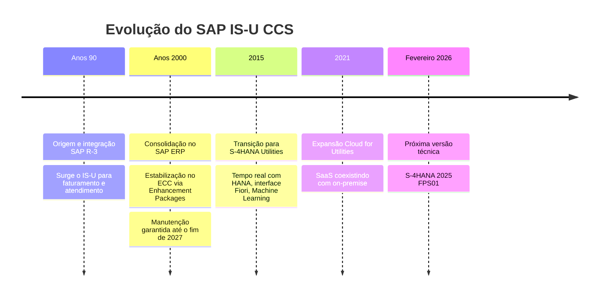

# GE-02: A evolução do produto, do R/3 ao SaaS
> Trinta e cinco anos em cinco marcos, e por que 2027 é a data que move o
> mercado inteiro.

**Onde entra:** contexto de negócio. Explica por que existe tanto projeto agora.
**Antes disto:** [GE-01-o-que-e-is-u-ccs](02-GE-01-o-que-e-is-u-ccs.md)

---

## A linha do tempo

---

## O quadro das três eras

| | **Era** | **Modelo de Software** | **Interface** |
|---|---|---|---|
| Passado | Clássica: On-Premise (R/3 e ECC) | | SAP GUI |
| Presente | | Moderna: On-Premise / Híbrido | SAP Fiori |
| Futuro | | SaaS (Cloud for Utilities) | Web / Nativo em Nuvem |

---

## A data que importa: **fim de 2027**

A manutenção garantida do ECC acaba no fim de 2027. Isso significa que toda
concessionária que ainda roda ECC precisa migrar para S/4HANA antes disso.

**É esta data que está gerando a onda de projetos, e é por isso que há
demanda por profissionais de IS-U agora.**

Você entra num mercado com prazo e com demanda represada. Isso é bom para
quem está começando.

---

## O erro que todo mundo comete

**Achar que "S/4HANA" muda o negócio.** Não muda. Objeto de Ligação continua
sendo Objeto de Ligação, o Contrato continua nascendo no Move-In.

**O que muda é a tecnologia por baixo e a tela por cima:** banco em memória,
processamento em tempo real, interface Fiori no lugar do SAP GUI.

O conceito que você está aprendendo agora **vale nas duas gerações**.

---

## Recall

1. Até quando o ECC tem manutenção garantida, e por que isso gera emprego?
2. Qual interface pertence a cada era?
3. O que muda e o que não muda do ECC para o S/4HANA?

> **Gabarito:** [`_GABARITOS.md`](_GABARITOS.md#ge-02)  ·  responda tudo antes de abrir.
