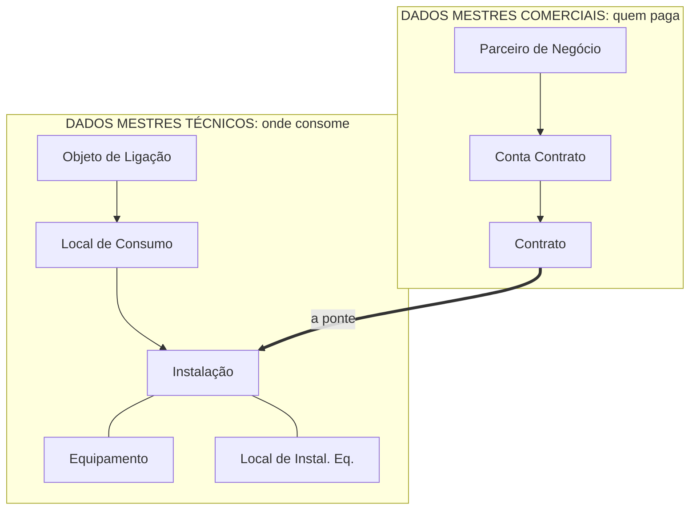

# MD-08: Os dois mundos e a validade no tempo
> O desenho que arruma comercial e técnico lado a lado, a ponte entre eles, e
> a armadilha de achar que a ordem do desenho é a hierarquia.

**Onde entra:** logo depois da [MD-01](05-MD-01-mapa-dos-dados-mestres.md). É a
segunda metade do mesmo assunto.
**Antes disto:** [MD-01-mapa-dos-dados-mestres](05-MD-01-mapa-dos-dados-mestres.md)

---

## Os dois mundos

**Equipamento e Local de Instalação de Equipamento fazem parte dos dados
mestres técnicos**, ligados à Instalação.

A seta grossa é o ponto inteiro do diagrama: **os dois mundos só se tocam no
Contrato indo para a Instalação.** Tudo o mais desce em linha reta dentro do
seu próprio lado.

---

## O erro que todo mundo comete

**Decorar a ordem errada.** O desenho usual põe os técnicos de cima para baixo
como *Instalação, Local de Consumo, Objeto de Ligação*.

**Mas a hierarquia física é o inverso:** o Objeto de Ligação é o nível mais
alto, e a Instalação é o nível mais baixo.

| Nível | Ordem usual de apresentação, específico para genérico | Hierarquia real, contém para contido |
|---|---|---|
| 1º | Instalação | **Objeto de Ligação**, o prédio |
| 2º | Local de Consumo | Local de Consumo, o apartamento |
| 3º | Objeto de Ligação | **Instalação**, o que fatura |

A apresentação vai do mais específico para o mais genérico. A realidade vai do
prédio para o medidor. **Não confunda a ordem do desenho com a hierarquia.**

---

## Dado mestre tem validade no tempo

Os objetos carregam data. O material mostra o campo em três lugares
diferentes:

| Objeto | O campo, como aparece na tela |
|---|---|
| **Parceiro de Negócios** | `Período de validade`, com o padrão `01.01.0001 - 31.12.9999` |
| **Contrato** | `Vigência`: datas de início e final, mais renovação e cancelamento |
| **Instalação** | `Vigência do tipo de tarifa` |

**Três objetos de blocos diferentes, todos com data.** Não é campo de um
cadastro só, é uma propriedade do modelo.

> **Em aberto:** o que o sistema faz quando a data muda, e se versões
> diferentes do mesmo objeto coexistem. **Esta atravessa as trilhas**, porque
> a data aparece no PN, no Contrato e na Instalação. Vale perguntar em
> qualquer aula. Ver [MD-07](16-MD-07-move-in-move-out.md).

---

## Na prática

Ver [02-BANCADA](../referencia/02-BANCADA.md) para as transações. Regra geral que se
repete: cada objeto tem **uma transação de uso** e **uma de customizing**.

---

## Se sobrar uma coisa

Os dois mundos se tocam em um ponto só: o Contrato.

---

## Recall

1. Em que ponto exato os dois mundos se tocam?
2. Qual é o nível mais alto dos dados mestres técnicos?
3. O que separa a ordem do desenho da hierarquia real dos objetos?
4. Cite os três objetos do material em que o campo de validade aparece.
5. Uma tarifa foi alterada sem olhar a data. Cite a consequência.

> **Gabarito:** [`_PISTAS.md`](_PISTAS.md#md-08)  ·  responda tudo antes de abrir.
