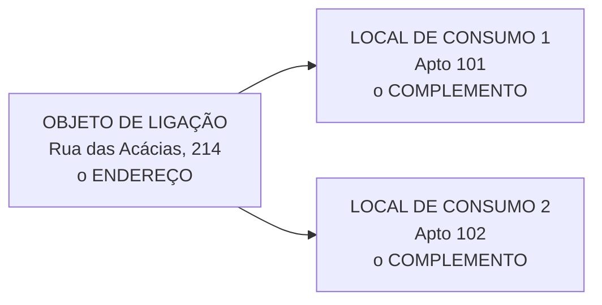

# ST-02: Local de Consumo
> A unidade que recebe energia e é medida separadamente. O apartamento dentro
> do prédio.

**Em inglês:** `Premise`. Use o nome em inglês quando a tradução em
português divergir entre materiais.
**Onde entra:** o nível do meio do mundo técnico.
**Antes disto:** [ST-01-objeto-de-ligacao](11-ST-01-objeto-de-ligacao.md)

---

## O que é

- Representa uma **unidade provida de energia elétrica e medida
  separadamente**
- **Assume o endereço do Objeto de Ligação**
- **É onde informamos o complemento do endereço**
- É criado quando surge uma **nova Unidade Consumidora**
- Campos relevantes:
  - **Tipo do Local de Consumo**
  - **Complemento do endereço**

---

## Exemplos

Andar · Apartamento · Lojas · Pilotis · Caixas · Pontos de ônibus ·
Torres de Telefonia · Outdoors · Bancas de Jornal · **IP e Semaforização**

`IP` é Iluminação Pública.

---

## A divisão do endereço

**Uma pergunta, duas respostas, dois objetos.** Endereço em cima,
complemento embaixo.

---

## O erro que todo mundo comete

**Achar que "medida separadamente" quer dizer "tem medidor".**

Não. Quer dizer que aquela unidade **é uma unidade de medição autônoma no
cadastro**. O medidor físico está em outro objeto, o Local de Instalação de
Equipamento, geralmente na garagem.

Local de Consumo é onde se **consome**. O relógio fica noutro lugar.

---

## Na prática

| Transação | O quê |
|---|---|
| `ES60` | Criar Local de Consumo |
| `ES61` | Modificar Local de Consumo |
| `ES62` | Exibir Local de Consumo |

Caminho: `Serviços públicos > Dados mestre técnicos > Local de consumo`

> **Atenção ao código de criação.** `ES61` modifica e `ES62` exibe. **Para
> criar, o correto é `ES60`.** Códigos parecidos como `ES53` não pertencem a
> este objeto.

**Exercício:** criar um local de consumo para o objeto de ligação
criado, e modificar o número/apto dele.

---

## Recall

1. O Local de Consumo tem endereço próprio?
2. Quais os dois campos relevantes dele?
3. Um prédio de 40 apartamentos: quantos objetos de ligação e quantos locais
   de consumo?

> **Gabarito:** [`_PISTAS.md`](_PISTAS.md#st-02)  ·  responda tudo antes de abrir.
