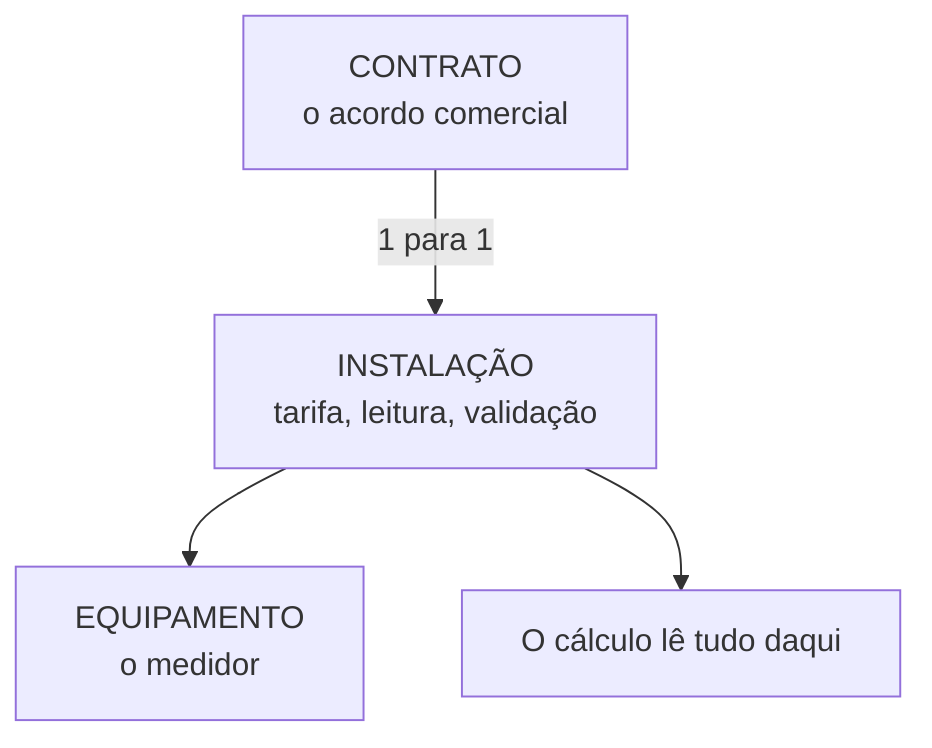

# ST-03: Instalação
> O objeto que efetivamente fatura. É aqui que moram a tarifa, a unidade de
> leitura e as regras de cálculo.

**Em inglês:** `Installation`. Use o nome em inglês quando a tradução em
português divergir entre materiais.
**Onde entra:** o nível mais baixo e mais importante do mundo técnico.
**Antes disto:** [ST-02-local-de-consumo](12-ST-02-local-de-consumo.md)

---

## A analogia

Se o Local de Consumo é o apartamento, **a Instalação é o ponto de energia
daquele apartamento com todas as suas regras**: qual tarifa, qual tensão,
quando é lido, o que é desconto.

É o objeto que o faturamento olha.

---

## O que é

- É um dado mestre técnico **diretamente relacionado ao cálculo e faturamento**
- **É onde se registram os dados necessários à medição e faturamento**
- **Determina as características do tipo de fornecimento de energia elétrica**
- Possui características da unidade consumidora, regras de cálculo e leitura,
  equipamentos, registradores e informações contratuais

---

## Os três blocos

| Bloco | Conteúdo |
|---|---|
| **Faturamento e Medição** | Tipo de Tarifa; Vigência do tipo de tarifa; Setor; **Unidade de leitura**; Tipo de validação |
| **Informações Individuais** | Descontos; Subsídios; **Indicador de Baixa Renda** |
| **Características Técnicas** | Nível de tensão; Nível de rede (tipo de circuito); Garantia de fornecimento |

**Indicador de Baixa Renda** é localização brasileira, ligada à tarifa social.

---

## Por que a Instalação é o centro de gravidade

O Contrato traz **quem paga**. A Instalação traz **como se calcula**.
Junte os dois e nasce a conta.

---

## O erro que todo mundo comete

**Achar que faturamento é problema do módulo de Billing.**

Quando uma conta sai errada, na maioria das vezes o defeito está no **dado
mestre da Instalação**: tarifa errada, vigência de tarifa vencida, unidade de
leitura trocada, tipo de validação inadequado.

O Billing só executa a regra que a Instalação carrega. **Olhe a Instalação
antes de acusar o cálculo.**

---

## Na prática

| Transação | O quê |
|---|---|
| `ES30` | Criar Instalação |
| `ES31` | Modificar Instalação |
| `ES32` | Exibir Instalação |

Caminho: `Serviços públicos > Dados mestre técnicos > Instalação`

> **Atenção ao código de criação.** `ES31` modifica e `ES32` exibe. **Para
> criar, o correto é `ES30`.**

**Exercício:** criar uma instalação de baixa tensão e instalar um
equipamento.

---

## Recall

1. Qual objeto guarda o tipo de tarifa?
2. O que é o Indicador de Baixa Renda e onde ele fica?
3. Conta veio com valor absurdo. Onde você olha antes de suspeitar do cálculo?

> **Gabarito:** [`_GABARITOS.md`](_GABARITOS.md#st-03)  ·  responda tudo antes de abrir.
