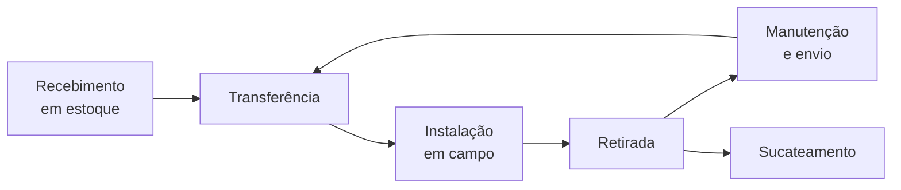

# DM-01: Ativos, movimentação e estoque
> O medidor tem uma vida inteira antes e depois de estar na parede. Device
> Management é quem sabe onde cada um está, e onde esteve.

**Onde entra:** primeira metade do Bloco 2, DM / GAT.
**Antes disto:** [SV-01-servico-de-campo](SV-01-servico-de-campo.md)
**Depois disto:** [DM-02-leituras-e-registradores](DM-02-leituras-e-registradores.md)

---

## O que o bloco DM cobre

Em uma linha: **a gestão dos ativos e equipamentos de medição.** Seis
frentes, três nesta nota e três na [DM-02](DM-02-leituras-e-registradores.md):

| Nesta nota | Na DM-02 |
|---|---|
| Gestão de equipamentos (ativos) | Tipos de leitura |
| Movimentação de equipamentos | Motivos de leitura |
| Gestão de estoque | Registradores |

**O corte é claro:** aqui é o aparelho como bem patrimonial; lá, o número que ele produz.

---

## O que conta como ativo

Seis itens, e a lista é mais larga do que "medidor":

| Ativo | O que é |
|---|---|
| **Medidores** | O relógio |
| **TC / TP** | Transformador de Corrente e de Potencial. Ver abaixo |
| **Módulos de comunicação** | O que faz o medidor falar sozinho com a central |
| **Equipamentos especiais** | ⟨não detalhado⟩ |
| **Dados técnicos e status** | O cadastro do aparelho |
| **Histórico completo** | Tudo que já aconteceu com aquele número de série |

**TC e TP existem porque cliente grande não passa direto pelo medidor.** A
corrente de uma indústria queimaria o aparelho. O transformador reduz o sinal
para uma escala que o medidor aguenta, e o sistema multiplica de volta por uma
constante. **O TP costuma ser esquecido em material introdutório.**

> **Se a constante do transformador estiver errada no cadastro, a conta sai
> errada por um fator, não por um pouco.** É o erro mais caro desta área.

**Histórico completo** é a frente que sustenta perícia: quando o cliente
contesta, é o histórico do número de série que reconstrói a verdade.

---

## O ciclo de vida do equipamento

Seis movimentos, e eles formam uma linha:

**Repare no laço.** Manutenção devolve o aparelho ao estoque, e ele pode ser
instalado de novo em outro imóvel. **O mesmo número de série passa por vários
clientes ao longo dos anos**, e é por isso que o histórico importa.

**Sucateamento é a única saída definitiva.** Depois dele o ativo some do
parque, e é um evento contábil, não só técnico.

---

## Estoque, que não é assunto de almoxarifado

Cinco itens: **entrada de materiais**, **transferências**, **reservas**,
**consumo em OS** e **inventário**.

Dois deles amarram DM em WM: **reserva** é o medidor separado para uma ordem
que ainda não foi executada, e **consumo em OS** é a baixa quando o técnico
efetivamente instalou.

**É aqui que nasce um chamado clássico:** *"o técnico chegou sem o medidor"*.
A ordem existia, a reserva não foi feita ou não foi respeitada, e a viagem foi
perdida. **O erro é de estoque, e aparece como falha de campo.**

**Inventário** é a contagem física contra o sistema. Diferença entre os dois é
a doença crônica da área: ou material sumiu, ou uma baixa foi lançada duas
vezes.

---

## Por que este bloco é ingrato e valioso

O sucesso aqui é invisível: ninguém elogia um parque de três milhões de
medidores que está certo, e **o erro aparece longe daqui**, na conta do cliente
ou numa fila de faturamento que não rodou. Isso torna DM uma área de
**auditoria antecipada**: o tempo vai em procurar divergência antes que ela
vire dinheiro errado.

---

## Recall

1. Qual é o corte entre esta nota e a DM-02?
2. Para que servem TC e TP, e qual o erro caro associado a eles?
3. Descreva o ciclo de vida do equipamento. Onde está o laço, e por quê?
4. Qual é a única saída definitiva de um equipamento do parque?
5. O técnico chegou em campo sem o medidor. Onde você procura a causa?
6. Por que "histórico completo" é a frente que sustenta perícia?

> **Gabarito:** [`_GABARITOS.md`](_GABARITOS.md#dm-01)  ·  responda tudo antes de abrir.
