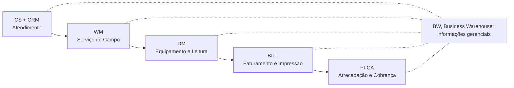

# GE-01: O que é o SAP IS-U CCS

> O conjunto de módulos que roda o ciclo comercial de uma concessionária,
> do cadastro do cliente até o dinheiro entrar.

**Onde entra:** é a moldura de tudo. Comece por aqui.
**Depois disto:** [GE-02-evolucao-do-produto](GE-02-evolucao-do-produto.md), [MD-01-mapa-dos-dados-mestres](MD-01-mapa-dos-dados-mestres.md)

---

## A analogia

Um ERP comum sabe vender produto, pagar fornecedor e fechar balanço. Ele não
sabe o que fazer com um medidor na parede de dez milhões de casas, cada um
gerando uma leitura por mês que vira uma conta diferente.

**O CCS é a camada que ensina o ERP a ser concessionária.**

---

## As duas siglas

| Sigla    | Expansão            |
| ---------- | ------------------------------------ |
| **CCS**  | *Customer Care Service*            |
| **IS-U** | *Industry Solutions for Utilities* |

São o mesmo produto, dois nomes. CCS é o nome funcional do conjunto; IS-U é
como a solução aparece no sistema.

## Características

- Agrupamento de módulos que suporta o **ciclo comercial** de empresas de
  Utilities (água, energia, gás e outros)
- **É integrado** com os demais módulos do SAP ECC: FI, MM, PM
- É mais direcionado para o mercado de **varejo de energia**
- **Uma implementação de IS-U costuma ser várias vezes maior que um projeto
  de ERP convencional**

---

## As cinco áreas funcionais

**Decore esta lista. É a espinha do módulo e a base das especializações.**

| Área        | O que faz                                                                                                                          |
| -------------- | ------------------------------------------------------------------------------------------------------------------------------------ |
| **CS + CRM** | Tela de atendimento, interações, nova ligação, religação, mudança de nome                                                   |
| **WM**       | Notas de serviço de campo, solicitações interdepartamentais, cadastro técnico e de endereços                                  |
| **DM**       | Cadastro de equipamentos, validação de medições, instalação, troca, certificação, calendário e roteirização de leituras |
| **BILL**     | Regras tarifárias, preços, descontos, impostos, faturamento e impressão de faturas                                              |
| **FI-CA**    | Pagamentos, vencimentos, multas, juros, contabilização, recebíveis, cobrança, corte, parcelamento                              |

**BW atravessa as cinco, mas não é uma delas.**

---

## O erro que todo mundo comete

**Achar que BW é a sexta área.** Não é. BW aparece como uma faixa
horizontal por baixo das cinco setas, não como uma sexta seta.

É por isso que **BW não é uma trilha do CCS** e não tem vaga: ele não faz
parte do produto, ele lê o produto.

---

## Na prática

Não há transação desta nota. Ela é conceitual.
Ver [02-BANCADA](../02-BANCADA.md) para as transações.

---

## Recall

1. Escreva as duas expansões, CCS e IS-U, corretamente.
2. Liste as cinco áreas funcionais na ordem da cadeia.
3. Onde BW aparece no desenho, e por que isso importa para a sua escolha de trilha?

> **Gabarito:** [`_GABARITOS.md`](_GABARITOS.md#ge-01)  ·  responda tudo antes de abrir.

---

## Ligações

[GE-02-evolucao-do-produto](GE-02-evolucao-do-produto.md) · [MD-01-mapa-dos-dados-mestres](MD-01-mapa-dos-dados-mestres.md)
