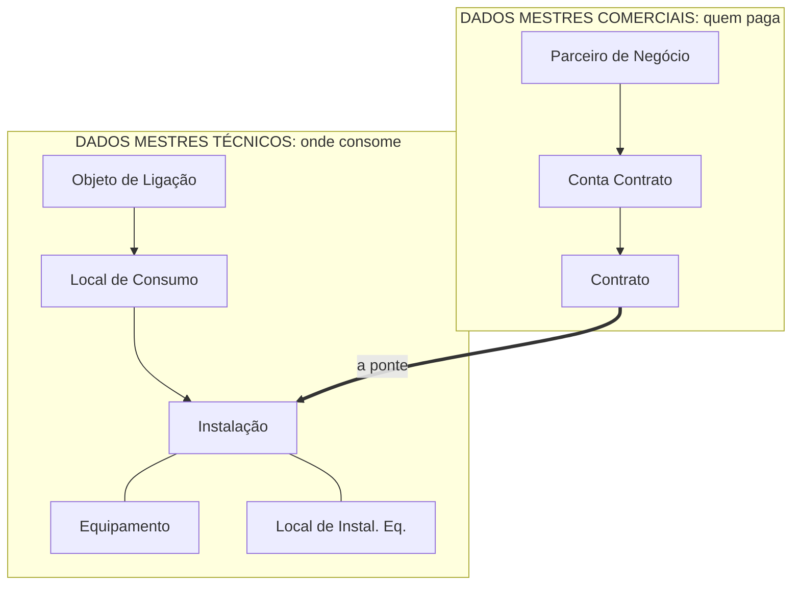

# MD-01: O mapa dos dados mestres
> Os cadastros sem os quais nada acontece, divididos em dois mundos que se
> encontram num ponto só.

**Onde entra:** é o coração dos dados mestres.
**Antes disto:** [GE-01-o-que-e-is-u-ccs](GE-01-o-que-e-is-u-ccs.md)

---

## A definição

> "Dados Mestre para o CCS são os cadastros necessários para o funcionamento
> do sistema."

## As quatro divisões

São **quatro**, não duas:

1. Estrutura Postal
2. Dados Mestre Técnicos
3. Dados Mestre Comercial
4. Dados Transacionais

**Objetivo declarado:** entender como esses dados estão representados no
sistema, e como eles se relacionam.

---

## Dado mestre x dado transacional

| | **Dados Mestres** | **Dados Transacionais** |
|---|---|---|
| O que são | Cadastros que serão usados pelo sistema (cliente, endereços) | Criados na execução dos processos comerciais (leitura, faturamento, instalação de equipamento, recebíveis) |
| Duração | **Inalterados por longo período**, e nesse período são a única versão válida | **Dinâmicos**, válidos por curto período |
| Exemplo | O cadastro da Dona Marta | A leitura de agosto e a conta de agosto |

**O critério é duração de validade, não importância.**

---

## Dado mestre tem validade no tempo

> **Status: escrito por mim**, a confirmar na documentação SAP.

No IS-U, muita coisa **não é simplesmente alterada**. Ela ganha uma **nova
versão com data de validade**, e as versões coexistem.

A Instalação pode ter tarifa A de 2019 a 2025 e tarifa B de 2026 em diante,
as duas no mesmo cadastro.

**Por que isso importa:** se você alterar um dado hoje sem prestar atenção na
data, **você pode ter alterado o passado**, e o sistema vai querer refaturar
meses já fechados.

É a mesma família de perigo da data de Move-In. Ver [MD-07-move-in-move-out](MD-07-move-in-move-out.md).

---

## Os dois mundos

**Equipamento e Local de Instalação de Equipamento fazem parte dos dados
mestres técnicos**, ligados à Instalação.

---

## O erro que todo mundo comete

**Decorar a ordem errada.** O desenho padrão põe os técnicos de cima para baixo
como *Instalação, Local de Consumo, Objeto de Ligação*.

**Mas a hierarquia física é o inverso:** o Objeto de Ligação é o nível mais
alto, e a Instalação é o nível mais baixo.

A lista vai do mais específico para o mais genérico. A realidade vai do
prédio para o medidor. **Não confunda a ordem do desenho com a hierarquia.**

---

## Na prática

Ver [02-BANCADA](../02-BANCADA.md) para as transações. Regra geral que se repete:
cada objeto tem **uma transação de uso** e **uma de customizing**.

---

## Recall

1. Quais são as quatro divisões dos dados mestres?
2. Qual é o critério que separa dado mestre de dado transacional?
3. Quem é o nível mais alto dos dados mestres técnicos?

> **Gabarito:** [`_GABARITOS.md`](_GABARITOS.md#md-01)  ·  responda tudo antes de abrir.

---

## Ligações

[MD-02-a-traducao-do-predio](MD-02-a-traducao-do-predio.md) · [MD-03-parceiro-de-negocios](MD-03-parceiro-de-negocios.md) ·
[ST-01-objeto-de-ligacao](ST-01-objeto-de-ligacao.md)
