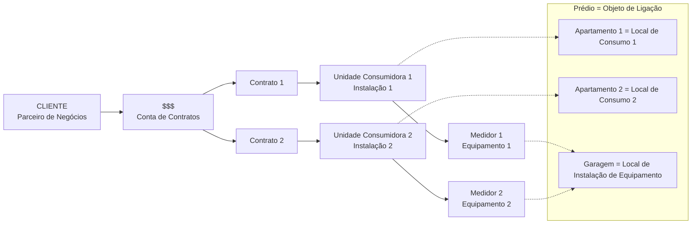

# MD-02: A tradução do prédio
> O diagrama que converte o mundo real inteiro em vocabulário SAP, de uma vez.

**Onde entra:** é a nota mais importante do conjunto.
**Antes disto:** [MD-01-mapa-dos-dados-mestres](MD-01-mapa-dos-dados-mestres.md)

---

## A analogia

A analogia parte de um prédio com dois apartamentos e uma garagem, primeiro
em português comum, depois com os nomes SAP por cima. **Guarde esta imagem
mental e você guarda metade da matéria.**

---

## A tabela de tradução

| Mundo real | Nome no SAP |
|---|---|
| O cliente | **Parceiro de Negócios** |
| A conta financeira dele | **Conta de Contratos** |
| O vínculo de fornecimento | **Contrato** |
| O prédio | **Objeto de Ligação** |
| O apartamento 1 | **Local de Consumo 1** |
| A unidade consumidora 1 | **Instalação 1** |
| A garagem (onde ficam os relógios) | **Local de Instalação de Equipamento** |
| O medidor 1 | **Equipamento 1** |

---

## O desenho

---

## O erro que todo mundo comete

**Achar que o medidor fica no apartamento.**

No desenho, o medidor está na **garagem**, não no apartamento. Por isso
existem dois objetos separados:

- **Local de Consumo** = onde a energia é consumida (o apartamento)
- **Local de Instalação de Equipamento** = onde o aparelho está fisicamente
  parafusado (a garagem)

Um prédio tem muitos Locais de Consumo e normalmente **um único** Local de
Instalação de Equipamento, com todos os relógios juntos.

---

## O exemplo concreto: o prédio da Dona Marta

> **Fonte: acervo próprio.** Caso que atravessa o material.

Rua das Acácias, 214, Ed. Jacarandá. **12 apartamentos mais 1 medidor de área
comum.** No sistema:

| Objeto | Quantidade |
|---|---|
| Objeto de Ligação | **1** |
| Local de Consumo | **13** |
| Instalação | **13** |
| Equipamento | **13** |
| **Contrato** | **só dos ocupados** |

Se dois apartamentos estão vazios, são **11 contratos e 13 instalações**.

> ### O detalhe que mais confunde
> **A quantidade de Instalações e a de Contratos não é a mesma.**
> Instalação existe sempre, porque é do imóvel. Contrato só existe quando tem
> alguém morando. Ver [MD-07-move-in-move-out](MD-07-move-in-move-out.md).

---

## Por que isto vale tanto

Ele responde de uma vez três perguntas que caem sempre:

1. **Quem é quem** no vocabulário
2. **Quem se liga a quem** (a cadeia PN → Conta → Contrato → Instalação → Equipamento)
3. **Onde o comercial encosta no técnico** (no Contrato)

---

## Recall

1. Traduza para SAP: prédio, apartamento, garagem, medidor, cliente.
2. Por que o Local de Consumo e o Local de Instalação de Equipamento são
   objetos diferentes?
3. Qual objeto liga o mundo comercial ao mundo técnico?

> **Gabarito:** [`_GABARITOS.md`](_GABARITOS.md#md-02)  ·  responda tudo antes de abrir.

---

## Ligações

[MD-01-mapa-dos-dados-mestres](MD-01-mapa-dos-dados-mestres.md) · [MD-06-contrato](MD-06-contrato.md) ·
[ST-01-objeto-de-ligacao](ST-01-objeto-de-ligacao.md) · [ST-04-equipamento](ST-04-equipamento.md)
