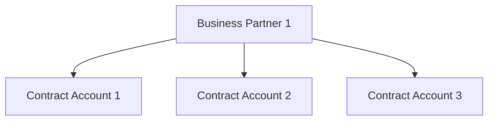

# MD-05: Conta Contrato
> A bolsa financeira do cliente. Reúne débitos e créditos, e é onde moram as
> regras de pagamento e de cobrança.

**Onde entra:** entre o Parceiro de Negócios e o Contrato.
**Antes disto:** [MD-03-parceiro-de-negocios](MD-03-parceiro-de-negocios.md)

---

## A analogia

O Parceiro de Negócios é a pessoa. A Conta Contrato é a **conta corrente que
ela tem com a concessionária**. Se ela quer misturar tudo numa fatura só, é
uma conta. Se quer separar a casa da praia do apartamento, são duas.

---

## O que é

- **Reúne os débitos e créditos do cliente**
- **Registra os dados de pagamento e cobrança**
- Agrupa todos os contratos de um PN **que possuem os mesmos dados de
  pagamento e cobrança**
- Uma conta contrato é vinculada a **um** parceiro de negócio (por padrão)
- **Um parceiro de negócio pode ter mais de uma conta contrato**
- **Faturamento está vinculado à conta contrato**
- **Um parceiro de negócios deve ter uma conta contrato por local de
  consumo**
- **Uma conta contrato pode ter vários contratos**

> **Atenção.** Separar por imóvel não é preferência do cliente, é **regra de
> modelagem**: uma conta contrato por local de consumo.

---

## O que é do PN e o que é da conta

| Nível | O que mora ali |
|---|---|
| **Business partner level** | **Solvência** (creditworthiness), automática ou manual |
| **Contract account level** | Condições de pagamento; chave de juros; **procedimento de cobrança individual**; ID de determinação de conta; categoria de conta |

**Distinção fina e cobrável:** a qualidade de pagador é da pessoa. A régua de
cobrança específica é da conta.

---

## Os três grupos de dados

| Grupo | Conteúdo |
|---|---|
| **Dados Gerais** | Parceiro de Negócios; Número da Conta; Data de vencimento; **Destinatário alternativo das faturas** |
| **Pagamentos** | Forma de pagamento; identificador da conta bancária do PN; **pagador alternativo de faturas** |
| **Cobrança** | Grupo de Cobrança; Procedimento de Cobrança; destinatário alternativo da cobrança; **Bloqueio do procedimento de corte/cobrança** |

**As três abas na tela:** `General data` · `Payments/Taxes` ·
`Dunning/Correspondence`

---

## Categoria de Conta Contrato

Cada conta contrato recebe uma **categoria**. Exemplos: Baixa Tensão,
Alta Tensão, Poder Público.

Os atributos da categoria especificam:
- Se a conta contrato tem **um ou mais contratos**
- Qual o intervalo de numeração válido
- Quais telas e campos serão exibidos ou alterados

**O mesmo padrão do PN se repete: a categoria decide comportamento e campos.**

---

## O erro que todo mundo comete

**Procurar o bloqueio de corte no lugar errado.**

- **Bloqueio de corte e cobrança** → mora na **Conta Contrato**
- **Bloqueio de faturamento** → mora no **Contrato**

Cliente com liminar judicial que não pode ser cortado? Conta Contrato.
Cliente que não deve gerar fatura este mês? Contrato.

Trocar os dois é o erro mais comum de quem está começando, e resolve ou
estraga um chamado real.

---

## Na prática

| Transação | O quê |
|---|---|
| `CAA1` | Criar Conta Contrato |
| `CAA2` | Modificar Conta Contrato |
| `CAA3` | Exibir Conta Contrato |
| `CAWM` | **Customizing** de conta contrato |
| `FPP2A` | Ativar modificações planejadas |

Caminho: `Serviços públicos > Dados mestre comerciais > Conta de contrato`
IMG: `Financial Accounting > Contract Accounting > Basic Functions >
Contract Accounts`

---

## Recall

1. Qual o critério para agrupar contratos numa mesma conta contrato?
2. Solvência é do PN ou da conta contrato?
3. Onde fica o bloqueio de corte, e onde fica o bloqueio de faturamento?

> **Gabarito:** [`_GABARITOS.md`](_GABARITOS.md#md-05)  ·  responda tudo antes de abrir.

---

## Ligações

[MD-03-parceiro-de-negocios](MD-03-parceiro-de-negocios.md) · [MD-06-contrato](MD-06-contrato.md)
