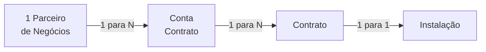

# MD-06: Contrato
> A dobradiça do sistema. É o único objeto que toca o mundo comercial e o
> mundo técnico ao mesmo tempo.

**Onde entra:** o ponto de encontro dos dois mundos.
**Antes disto:** [MD-05-conta-contrato](MD-05-conta-contrato.md)

---

## A analogia

A Conta Contrato é a carteira. A Instalação é a tomada. **O Contrato é o
acordo que diz que aquela carteira paga por aquela tomada.**

Sem ele, você tem um cliente sem consumo e um consumo sem dono.

---

## As oito regras

**Este é o tema mais denso em regra que cai em prova. Decore.**

1. Representa um **acordo** entre o Parceiro de Negócio e a Empresa de Utility
2. **É criado durante o Move In**, e liga os dados mestres comerciais aos técnicos
3. Contém parâmetros para **cálculo de consumo** e para gerenciamento de recebíveis
4. Um PN pode ter várias Contas Contratos, que por sua vez podem ter vários
   Contratos alocados
5. **É o objeto que liga a Conta Contrato à Instalação**
6. **Um Contrato só pode estar ligado a UMA Conta Contrato e UMA Instalação**
7. Refere-se a uma empresa (Company Code) e a um único Setor de Atividade
8. **O Cálculo ocorre no nível do Contrato**

---

## A cardinalidade completa

**De cima para baixo é um para muitos. Na ponta, é um para um.**

---

## Os três blocos de dados

| Bloco | Conteúdo |
|---|---|
| **Dados Gerais** | Conta de Contratos; indicador de faturamento conjunto; **Bloqueio do faturamento** |
| **Vigência** | Datas de início e fim de vigência; datas de renovação e de cancelamento |
| **Contabilização** | Chave de imposto ICMS; determinador de Classe Contábil |

---

## O erro que todo mundo comete

**Procurar a transação de criar contrato. Ela não existe.**

Olhe a lista de transações do Contrato: há `ES21` modificar, `ES22`
exibir, `ES27` modificar todos, `ES28` exibir todos. **Nenhuma de criar.**

Porque **o Contrato nasce do processo de Move In**, nunca de um cadastro
direto. Quem procura "criar contrato" no menu não vai achar, e vai concluir
errado que falta autorização.

---

## Na prática

| Transação | O quê |
|---|---|
| `ES21` | Modificar Contrato |
| `ES22` | Exibir Contrato |
| `ES27` | Modificar Todos Contratos |
| `ES28` | Exibir Todos os Contratos |

**Criar: só via Move In.** O material diz que *"o Contrato é criado durante o
Move In"* e não dá o código da transação. **Perguntar ao instrutor.**

---

## Recall

1. Quando o Contrato é criado?
2. Um contrato pode estar ligado a duas instalações?
3. Em que nível ocorre o cálculo?
4. Por que não existe transação de criar contrato?

> **Gabarito:** [`_GABARITOS.md`](_GABARITOS.md#md-06)  ·  responda tudo antes de abrir.

---

## Ligações

[MD-05-conta-contrato](MD-05-conta-contrato.md) · [ST-03-instalacao](ST-03-instalacao.md) · [MD-02-a-traducao-do-predio](MD-02-a-traducao-do-predio.md)
