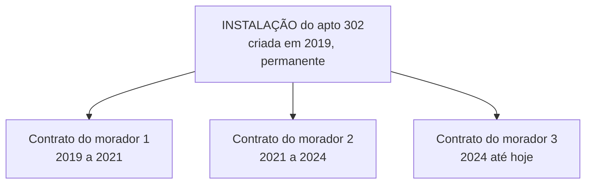

# MD-07: Move-In e Move-Out
> O processo que cria e encerra o Contrato.

**Onde entra:** é o processo que produz o objeto de [MD-06-contrato](MD-06-contrato.md).
**Antes disto:** [MD-06-contrato](MD-06-contrato.md), [ST-03-instalacao](ST-03-instalacao.md)
**Status:** escrito por mim. **A confirmar na documentação SAP**, transações
e detalhes.

---

> **Esta nota preenche a maior lacuna do grafo de dependências.**
> O Contrato é criado durante o Move In, mas o processo costuma ser tratado
> à parte dos dados mestres, o que deixa a ponta solta.
> Ver [_DEPENDENCIAS](_DEPENDENCIAS.md).

---

## A analogia

Mudança de apartamento. **A casa não muda, o morador muda.**

O apartamento 302 existe desde 2019 e vai continuar existindo. Ele já teve
três moradores. Cada morador teve o seu contrato de fornecimento, com início
e fim. **O apartamento viu todos passarem.**

Move-In é a chegada de um morador. Move-Out é a saída.

---

## O conceito que sustenta tudo: a Instalação é do imóvel, não da pessoa

**É um dos conceitos mais importantes do módulo e o que mais cai em prova.**

A Instalação do apartamento 302 foi criada em 2019 e **nunca vai ser apagada**.
Já teve três moradores, cada um com o seu Contrato.

**Consequência prática:** quando o morador sai, você **não apaga a Instalação**.
Você **encerra o Contrato**. A Instalação fica lá, sem contrato ativo,
esperando o próximo.

Um imóvel nessa situação é um **imóvel desocupado**, e o sistema monitora
esses casos. **Se aparecer consumo numa instalação sem contrato ativo, isso é
forte indício de ligação clandestina.**

---

## Os três processos

| Processo | O que faz | O que sempre acompanha |
|---|---|---|
| **Move-In** | **Cria o Contrato** numa data | Leitura **inicial** |
| **Move-Out** | **Encerra o Contrato** numa data | Leitura **final**, e faturamento final |
| **Move-In/Out** | Os dois ao mesmo tempo | **Uma leitura só**, que serve de final para um e inicial para o outro |

O Move-In/Out existe porque na vida real a troca é simultânea: um sai no dia
que o outro entra, e mandar dois leituristas ao mesmo medidor no mesmo dia
seria absurdo.

---

## O erro que todo mundo comete

**Achar que a data do Move-In é só uma formalidade.**

Ela é **o marco que separa o que é dívida de quem**, e é o campo mais perigoso
da tela.

- **Move-In com data errada** gera consumo do morador anterior cobrado do novo.
  Vira reclamação, estorno e refaturamento.
- **Move-In com data retroativa sobre período já faturado** é uma das operações
  mais caras do sistema, porque obriga a desfazer e refazer tudo o que veio
  depois.

---

## Na prática

**Transações: não confirmadas.** Ficam na área de Customer Service do menu
IS-U.

**Esta é a lacuna prioritária a fechar**, porque sem Move-In não
existe Contrato, e sem Contrato não existe faturamento.

Ver [02-BANCADA](../referencia/02-BANCADA.md).

---

## Recall

1. O morador se muda. O que acontece com a Instalação, e o que acontece com o Contrato?
2. O que sempre acompanha um Move-In?
3. Consumo registrado numa instalação sem contrato ativo. O que isso sugere?
4. Por que Move-In com data retroativa é caro?

> **Gabarito:** [`_GABARITOS.md`](_GABARITOS.md#md-07)  ·  responda tudo antes de abrir.

---

## Ligações

[MD-06-contrato](MD-06-contrato.md) · [ST-03-instalacao](ST-03-instalacao.md) · [_DEPENDENCIAS](_DEPENDENCIAS.md)
