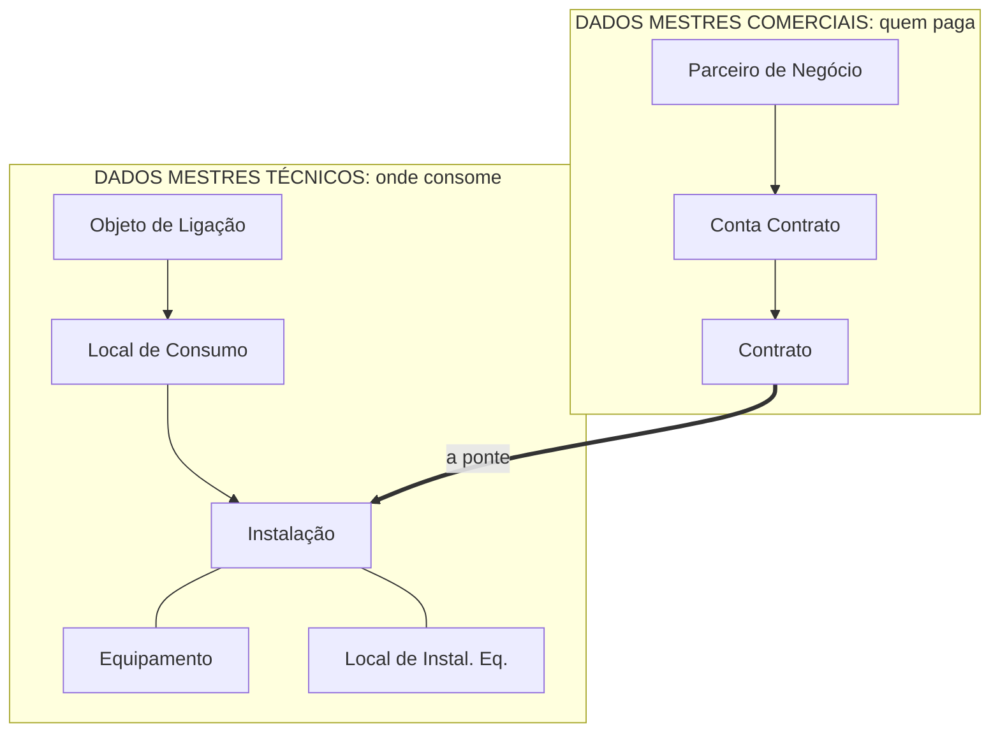

# MD-08: Os dois mundos e a validade no tempo
> O desenho que arruma comercial e técnico lado a lado, a ponte entre eles, e
> a armadilha de achar que a ordem do desenho é a hierarquia.

**Onde entra:** logo depois da [MD-01](MD-01-mapa-dos-dados-mestres.md). É a
segunda metade do mesmo assunto.
**Antes disto:** [MD-01-mapa-dos-dados-mestres](MD-01-mapa-dos-dados-mestres.md)

---

## Os dois mundos

**Equipamento e Local de Instalação de Equipamento fazem parte dos dados
mestres técnicos**, ligados à Instalação.

A seta grossa é o ponto inteiro do diagrama: **os dois mundos só se tocam no
Contrato indo para a Instalação.** Tudo o mais desce em linha reta dentro do
seu próprio lado.

---

## O erro que todo mundo comete

**Decorar a ordem errada.** O desenho usual põe os técnicos de cima para baixo
como *Instalação, Local de Consumo, Objeto de Ligação*.

**Mas a hierarquia física é o inverso:** o Objeto de Ligação é o nível mais
alto, e a Instalação é o nível mais baixo.

| Nível | Ordem usual de apresentação, específico para genérico | Hierarquia real, contém para contido |
|---|---|---|
| 1º | Instalação | **Objeto de Ligação**, o prédio |
| 2º | Local de Consumo | Local de Consumo, o apartamento |
| 3º | Objeto de Ligação | **Instalação**, o que fatura |

A apresentação vai do mais específico para o mais genérico. A realidade vai do
prédio para o medidor. **Não confunda a ordem do desenho com a hierarquia.**

---

## Dado mestre tem validade no tempo

> **Status: escrito por mim**, a confirmar na documentação SAP.

No IS-U, muita coisa **não é simplesmente alterada**. Ela ganha uma **nova
versão com data de validade**, e as versões coexistem.

A Instalação pode ter tarifa A de 2019 a 2025 e tarifa B de 2026 em diante,
as duas no mesmo cadastro.

**Por que isso importa:** se você alterar um dado hoje sem prestar atenção na
data, **você pode ter alterado o passado**, e o sistema vai querer refaturar
meses já fechados.

É a mesma família de perigo da data de Move-In. Ver [MD-07-move-in-move-out](MD-07-move-in-move-out.md).

---

## Na prática

Ver [02-BANCADA](../referencia/02-BANCADA.md) para as transações. Regra geral que se
repete: cada objeto tem **uma transação de uso** e **uma de customizing**.

---

## Recall

1. Em que ponto exato os dois mundos se tocam?
2. Qual é o nível mais alto dos dados mestres técnicos?
3. Por que a ordem do desenho não é a hierarquia?
4. O que acontece se você alterar a tarifa de uma instalação sem olhar a data
   de validade?

> **Gabarito:** [`_GABARITOS.md`](_GABARITOS.md#md-08)  ·  responda tudo antes de abrir.

---

## Ligações

[MD-01-mapa-dos-dados-mestres](MD-01-mapa-dos-dados-mestres.md) · [MD-02-a-traducao-do-predio](MD-02-a-traducao-do-predio.md) · [MD-06-contrato](MD-06-contrato.md) · [ST-03-instalacao](ST-03-instalacao.md)
