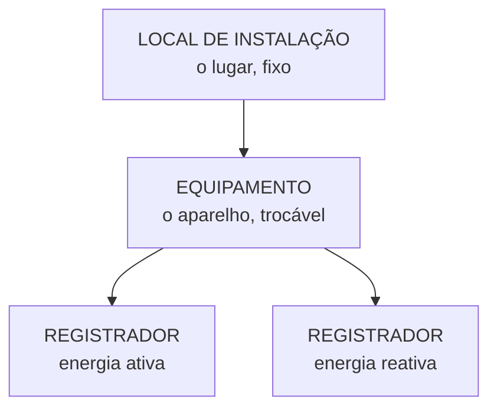
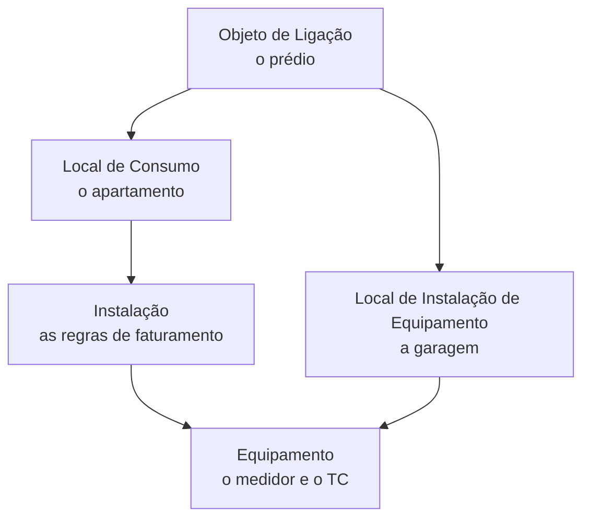

# ST-04: Equipamento e Local de Instalação
> O aparelho físico e o lugar onde ele está parafusado. E as três formas de
> instalar, que explicam um chamado clássico.

**Em inglês:** `Device`. Use o nome em inglês quando a tradução em
português divergir entre materiais.
**Onde entra:** a ponta física da cadeia.
**Antes disto:** [ST-03-instalacao](ST-03-instalacao.md)

---

## A analogia

**Local de Instalação do Equipamento** é a parede da garagem cheia de
relógios. **Equipamento** é cada relógio.

---

## Local de Instalação do Equipamento

> "É o lugar em que os equipamentos de ligação serão instalados."

Exemplos: **garagem** e **andar de um prédio**.

Um Objeto de Ligação normalmente tem **um** Local de Instalação de
Equipamento, com todos os medidores juntos, enquanto tem **vários** Locais de
Consumo.

| Transação | O quê |
|---|---|
| `ES65` | Criar Local de Instalação de Equipamento |
| `ES66` | Modificar |
| `ES67` | Exibir |

---

## Equipamento

Há dois tipos de caixa de medição:

- **Medidor**
- **Transformador de Corrente (TC)**

**Não é só o medidor.** Em cliente de alta tensão, o transformador de corrente
também é cadastrado como Equipamento.

---

## Registrador

**O Registrador é a grandeza que o aparelho acumula, e um medidor pode ter
vários.** Os seis tipos que o material lista estão na
[DM-02](DM-02-leituras-e-registradores.md).

| Objeto | O que é |
|---|---|
| **Local de Instalação de Equipamento** | *"O lugar em que os equipamentos de ligação serão instalados"* |
| **Equipamento** | O aparelho, com número de série |
| **Registrador** | A grandeza medida dentro do aparelho |

**Os três são objetos separados, e é isso que permite trocar um sem mexer nos
outros.**

**Por que três objetos e não um:** trocar o medidor não bagunça nada. Só o
Equipamento muda. O Local de Instalação continua, a Instalação continua, o
histórico continua.

**E é aqui que a instalação para faturamento entra:** ela liga **cada
registrador a um item da tarifa**, ensinando o sistema a interpretar o número.
É por isso que `EG34` existe separado de `EG33`.

---

## As três formas de instalar, e por que isso importa

Esta é a parte mais valiosa da nota.

| Transação | Modalidade | O que faz |
|---|---|---|
| `EG31` | **Total** | Instalação completa, técnica **e** com efeito no faturamento |
| `EG33` | **Técnico** | Coloca o aparelho fisicamente, **sem mexer no faturamento** |
| `EG34` | **Com efeito no cálculo da fatura** | A parte que liga o aparelho ao cálculo |
| `EG51` | **Estorno técnico** | Desfaz a instalação técnica |

Caminho: `Serviços públicos > Gerência de equipamentos > Instalação >
Instalação`

---

## O erro que todo mundo comete

**Trocar o medidor no campo e a conta continuar vindo com o número antigo.**

A causa quase sempre é esta: alguém fez **instalação técnica** (`EG33`) e não
fez a parte **com efeito no cálculo** (`EG34`). O aparelho está lá
fisicamente, o sistema sabe disso, mas o faturamento ainda não foi informado.

**Saber que instalação tem duas metades é o que separa quem resolve esse
chamado em cinco minutos de quem escala.**

---

## Onde tudo se encaixa

---

## Recall

1. Um prédio de 40 apartamentos tem quantos Locais de Instalação de Equipamento?
2. Além do medidor, o que mais é Equipamento?
3. Medidor trocado no campo, conta ainda com leitura do antigo. Hipótese?

> **Gabarito:** [`_GABARITOS.md`](_GABARITOS.md#st-04)  ·  responda tudo antes de abrir.

---

## Ligações

[ST-03-instalacao](ST-03-instalacao.md) · [MD-02-a-traducao-do-predio](MD-02-a-traducao-do-predio.md)
