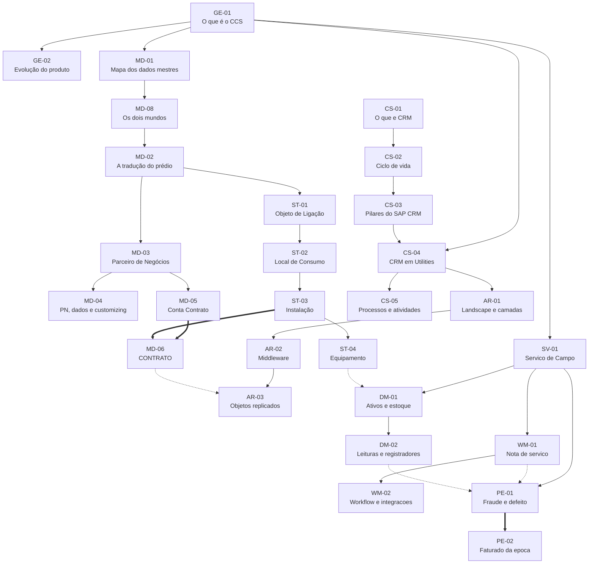

# MAPA DE DEPENDÊNCIAS
### A ordem real do aprendizado, e as lacunas que ela revela

> **Por que este arquivo existe.** A ordem de estudo de IS-U não é arbitrária:
> ela está embutida na estrutura do conteúdo. Ninguém entende Local de Consumo
> antes de Objeto de Ligação, porque um não existe sem o outro.
>
> **Bônus:** dependência detecta lacuna. Um conceito citado **sem o
> pré-requisito explicado** é evidência de que falta alguma coisa no material.

---

## O grafo

---

## A leitura mais importante do grafo

**O Contrato é o único conceito que exige os dois ramos completos.**

Todo o resto desce em linha reta: comercial de um lado, técnico do outro. O
Contrato é o único nó com **duas setas grossas entrando**, uma de cada mundo.

Três consequências:

1. **É por isso que ele costuma ser ensinado por último.** Não dá para ensinar antes.
2. **É por isso que ele é o mais difícil.** Exige tudo o que veio antes.
3. **É por isso que ele é o que mais cai.** É onde o entendimento se prova.

Se você entende o Contrato de verdade, entende os dados mestres inteiros. Se
não entende, o problema está em algum nó acima dele, não nele.

---

## Ordem de estudo derivada

`GE‑01` → `MD‑01` → `MD‑02` → então os dois ramos em paralelo:

| Ramo comercial | Ramo técnico |
|---|---|
| `MD‑03` Parceiro de Negócios | `ST‑01` Objeto de Ligação |
| `MD‑04` PN, dados | `ST‑02` Local de Consumo |
| `MD‑05` Conta Contrato | `ST‑03` Instalação |
| | `ST‑04` Equipamento |

E os dois convergem em **`MD‑06` Contrato**.

`GE‑02` (evolução do produto) é folha solta: útil, sem dependente.

---

# PONTOS EM ABERTO

O método: procurar conceito **citado mas nunca desenvolvido**, ou nó de menu
**visível mas nunca aberto**. Cada um é um buraco no modelo.

## Antes de tudo: lacuna estrutural não é falha de captura

A semana 1 é **um panorama por área, um dia cada**. Ela entrega as listas, os
nomes e a fronteira entre os blocos, e para aí. **O aprofundamento vem na
semana 2, e só da trilha escolhida.**

Consequência direta: **quase toda pergunta específica de módulo nasce sem
resposta e vai continuar assim**, a menos que a trilha seja aquela. Não
adianta esperar que uma aula futura feche, nem preencher por dedução, que foi
exatamente o erro da Estrutura Postal.

| Pergunta | Onde nasceu | Quem fecha |
|---|---|---|
| O conteúdo da **Estrutura Postal** e a relação com Estrutura Regional | A01, dados mestres | **SVC.** O material põe estruturas postais e políticas sob WM |
| A transação de **Move-In** | A01, contrato | **CS + CRM.** Move-In é processo de atendimento (CIC) |
| Se **Alteração de titularidade** é Move-Out mais Move-In | A02, processos | **CS + CRM** |
| O que é um **operando** | A03, workflow de campo | **BILL**, é termo de esquema de cálculo. Pode vir na aula de Faturamento |
| O que são **TE** e **TUSD** | A03, perdas | **BILL**, são parcelas da tarifa. Pode vir na aula de Faturamento |
| Se **Perdas é trilha própria** | A03, os três blocos | **Sexta**, quando a lista de trilhas for apresentada |

**Duas dessas podem fechar de graça**, porque tarifa é assunto de Faturamento
e essa aula está no calendário. As outras dependem da escolha.

**Como isto entra na decisão de sexta:** cada trilha fecha um conjunto
diferente destas lacunas. Não é o critério principal para escolher, mas é
informação real sobre o que você leva embora e o que fica em aberto para
sempre.

## Fechados por nota própria

| Conceito | Por que era lacuna | Situação |
|---|---|---|
| **Move In** | O Contrato "é criado durante o Move In", mas o processo é tratado à parte dos dados mestres | Coberto por [MD-07-move-in-move-out](16-MD-07-move-in-move-out.md), **em reconstrução minha**. A transação só fecha na trilha de CS + CRM |
| **Registrador** | Citado junto de equipamento, quase nunca definido | **Fechado pelo material**: a A03 lista os seis registradores. Ver [DM-02](29-DM-02-leituras-e-registradores.md) |

> **Cuidado com a primeira linha.** A [MD-07](16-MD-07-move-in-move-out.md) é
> reconstrução minha em cima de duas frases do material. Ela tapa o buraco no
> grafo, mas **não é fonte**.

## Estruturais: fazem parte do modelo e ainda não cobri

| Conceito | Evidência | Situação |
|---|---|---|
| ~~**Ponto de Entrega (PoD)**~~ | Aparecia no menu de dados mestres técnicos e nunca era desenvolvido | **PARCIALMENTE COBERTO** por [AR-03-objetos-replicados](24-AR-03-objetos-replicados.md): tem posição na arquitetura e tabela `EUIHEAD` ⟨confirmar⟩. **Faltam as transações e a cardinalidade** |
| **Ligação** | Nó no menu, entre Objeto de Ligação e Local de Consumo | Não explorado |
| **Estrutura Postal** | Divisão 1 de 4 dos dados mestres (slide `img-05` da A01), e WM "mantém estruturas políticas e postais" (A02) | **Nomeada e nunca desenvolvida.** Conteúdo e transações em aberto |
| **Estrutura Regional** | Nó no menu | Não desenvolvida |

## Próximos temas

| Conceito | Onde se encaixa |
|---|---|
| **Dados Transacionais** | Divisão 4 de 4, entra com leitura e faturamento |
| **Planejamento de datas** | MRU e porções |
| **CIC** | Interface centralizada de atendimento, área de CS/CRM |
| **EDM** | Gestão de dados de medição |

---

## Pontos em aberto de CRM e arquitetura

| Conceito | Situação |
|---|---|
| **Prospect, Lead e Oportunidade** | Os três termos que mais se confundem em CRM, e ainda não escrevi a nota. **Contribuição muito bem-vinda** |
| **`EHAUISU` x `EHAU`** | Duas formas para a tabela do Objeto de Ligação. Não sei qual é a correta |
| **`FOP`** | Sigla que aparece em "Processos/FOPs" e que não consegui expandir |
| **Webclient, modelagem de processos, validações, vínculos, estrutura organizacional** | Temas de CRM que este material ainda não cobre |

---

## Como manter isto

A cada tema novo:

1. Acrescentar os nós novos ao grafo, ligando ao pré-requisito
2. Procurar **conceito citado sem definição** e **nó de menu não aberto**
3. Verificar se alguma lacuna anterior **foi fechada** e riscar da lista

**O sinal de saúde:** lacuna que fecha logo é sequência normal de estudo.
Lacuna que atravessa o material inteiro é assunto que a fonte não cobre, e aí
você decide se estuda por fora.

---

**Fontes públicas consultadas para validar o modelo padrão:**

- [SAP IS-U data model, Business and Technical Master Data](https://blogs.sap.com/2012/03/26/sap-is-u-data-model-business-and-technical-master-data/)
- [SAP ISU Technical Master Data, dimplethoughts](https://dimplethoughts.wordpress.com/2018/07/19/sap-isu-technical-master-data/)
- [ISU Data Model Information, Sachin H Patil](https://sachinhpatil.com/sapis-utilities/isu-data-model-information/)
- [SAP IS-U, Wikipedia](https://en.wikipedia.org/wiki/SAP_IS-U)
- [Tabela EVER, SAP Datasheet](https://www.sapdatasheet.org/abap/tabl/ever.html)
