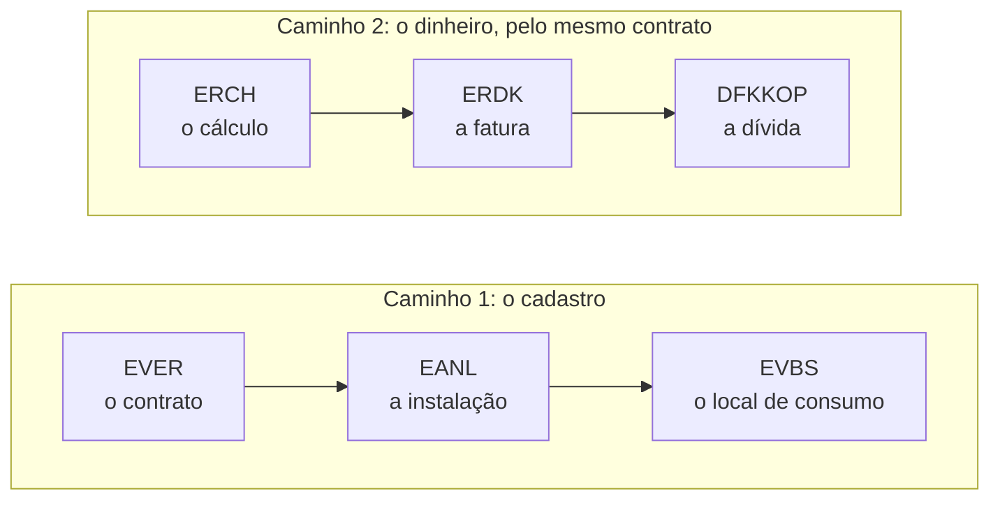
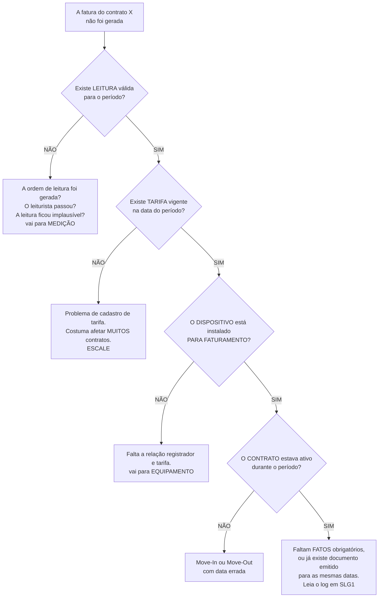
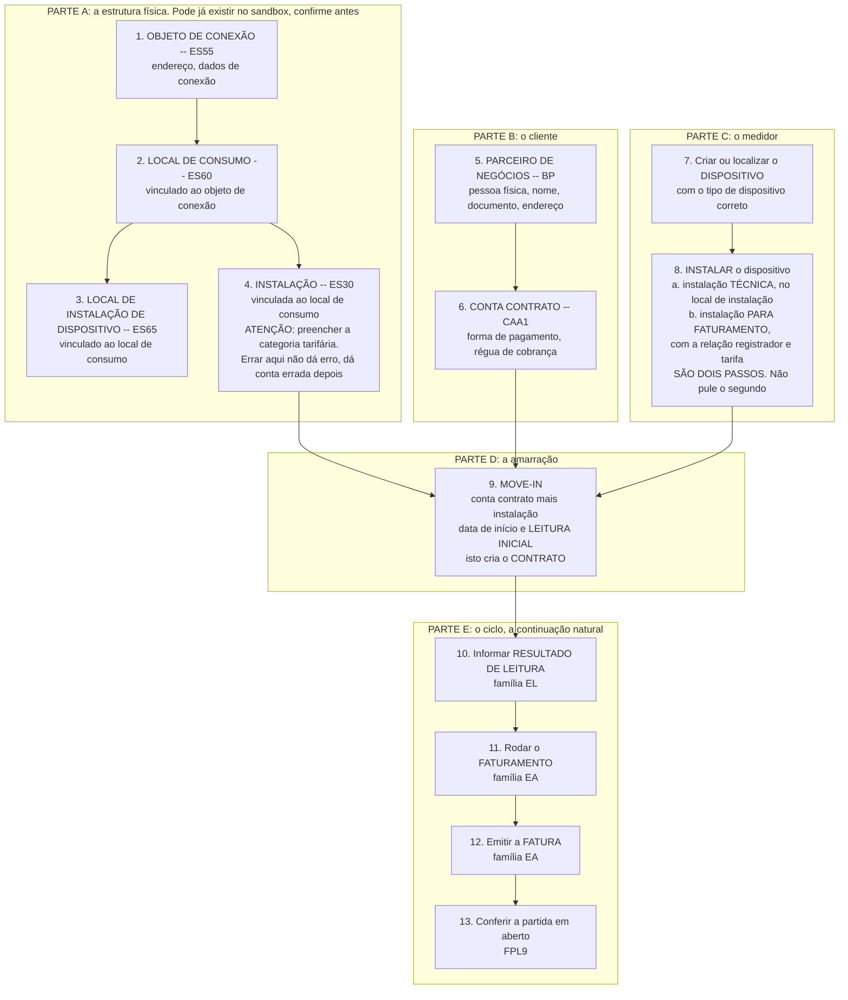

# A BANCADA

### Consulta, não leitura

> **Este arquivo não é para ser estudado.** É uma caixa de ferramentas.
> Abra quando estiver diante do sistema ou quando precisar lembrar de uma sigla.
> Ler isto em sequência é a melhor forma de desperdiçar seu tempo de preparação.
>
> **Por que ele fica inteiro e não vira nota atômica:** isto é consulta, não
> revisão. Você procura aqui, não lê. Um `Ctrl+F` num arquivo vale mais que
> abrir oito. **Lookup quer ser grande e buscável.**

## Salto rápido: as transações que você mais vai usar


| Preciso de                                              | Transação                  |
| --------------------------------------------------------- | ------------------------------ |
| Criar / modificar / exibir **Parceiro de Negócios**     | `FPP1` `FPP2` `FPP3` ou `BP` |
| Criar / modificar / exibir **Conta Contrato**            | `CAA1` `CAA2` `CAA3`         |
| Modificar / exibir **Contrato**                          | `ES21` `ES22`                |
| Criar / modificar / exibir **Objeto de Ligação**       | `ES55` `ES56` `ES57`         |
| Criar / modificar / exibir **Local de Consumo**          | `ES60` `ES61` `ES62`         |
| Criar / modificar / exibir **Instalação**              | `ES30` `ES31` `ES32`         |
| Criar / modificar / exibir **Local de Instal. Equip.** | `ES65` `ES66` `ES67`         |
| **Instalar equipamento** (total / técnica / cálculo)  | `EG31` `EG33` `EG34`         |
| Parametrizar qualquer coisa                             | `SPRO`                       |
| Achar uma transação pelo nome                         | `SE93`                       |

**Menu em português:** `Serviços públicos`, não "Utilities".

**Índice**

1. [Glossário de siglas](#1-glossário-de-siglas)
2. [Como achar qualquer transação sem chutar](#2-como-achar-qualquer-transação-sem-chutar)
3. [Transações por módulo](#3-transações-por-módulo)
4. [Tabelas](#4-tabelas)
5. [Checklist: o que precisa existir para faturar](#5-checklist-o-que-precisa-existir-para-faturar)
6. [Fluxograma de diagnóstico: a fatura não saiu](#6-fluxograma-de-diagnóstico-a-fatura-não-saiu)
7. [Roteiro do exercício: criar um cliente do zero](#7-roteiro-do-exercício-criar-um-cliente-do-zero)
8. [Preparação para prova e entrevista técnica](#8-preparação-para-prova-e-entrevista-técnica)
9. [Armadilhas de iniciante, lista consolidada](#9-armadilhas-de-iniciante-lista-consolidada)

---

# 1. Glossário de siglas


| Sigla         | Nome completo em inglês                   | Em português                                                  | O que faz                                                                                           |
| --------------- | -------------------------------------------- | ---------------------------------------------------------------- | ----------------------------------------------------------------------------------------------------- |
| **IS-U**      | Industry Solution for Utilities            | Solução Setorial para Concessionárias                       | O conjunto de módulos SAP para cadastro, medição, faturamento e cobrança de serviços públicos |
| **BP**        | Business Partner                           | Parceiro de Negócios                                          | Quem é a pessoa ou empresa: nome, documento, endereço, contatos                                   |
| **CA**        | Contract Account                           | Conta Contrato                                                 | Como o cliente paga: forma de pagamento, régua de cobrança, agrupamento de fatura                 |
| **PoD**       | Point of Delivery                          | Ponto de Entrega                                               | Identificador padronizado do ponto de fornecimento, para troca de dados entre agentes de mercado    |
| **DM**        | Device Management                          | Gestão de Dispositivos                                        | Ciclo de vida do medidor: instalação, troca, remoção, aferição, registradores                 |
| **EDM**       | Energy Data Management                     | Gestão de Dados de Energia                                    | Medição em intervalos (curva de carga), perfis, faturamento por intervalo                         |
| **WM**        | Work Management                            | Gestão de Serviços de Campo                                  | Planeja, despacha e confirma trabalho em campo.<br />**Não confundir com Warehouse Management**    |
| **FI-CA**     | Contract Accounts Receivable and Payable   | Contas a Receber e a Pagar por Conta Contrato                  | Contas a receber de alto volume: partidas, pagamentos, cobrança, repasse ao razão                 |
| **IDE**       | Intercompany Data Exchange                 | Troca de Dados entre Empresas                                  | Processos de mercado desregulamentado: troca de fornecedor, envio de medição entre agentes        |
| **MDUS**      | Meter Data Unification and Synchronization | Unificação e Sincronização de Dados de Medição           | Integração entre o SAP e o sistema de telemetria                                                  |
| **AMI**       | Advanced Metering Infrastructure           | Infraestrutura de Medição Avançada                          | Medidores inteligentes, rede de comunicação e concentradores                                      |
| **RTP**       | Real Time Pricing                          | Preço em Tempo Real                                           | Tarifa que varia por intervalo, faturada a partir de curva de carga                                 |
| **MRU**       | Meter Reading Unit                         | Unidade de Leitura                                             | Agrupamento geográfico: a rota do leiturista                                                       |
| **CRM**       | Customer Relationship Management           | Gestão do Relacionamento com o Cliente                        | Atendimento: contatos, solicitações, reclamações                                                |
| **BW**        | Business Warehouse                         | Armazém de Dados de Negócio                                  | Extrai, armazena e reporta dados para análise                                                      |
| **FI**        | Financial Accounting                       | Contabilidade Financeira                                       | Razão contábil e balanço. Recebe totais do FI-CA                                                 |
| **CO**        | Controlling                                | Controladoria                                                  | Custos e centros de custo. Recebe custo das ordens de serviço                                      |
| **PM**        | Plant Maintenance                          | Manutenção de Ativos                                         | Manutenção de equipamentos. Base técnica do dispositivo e do WM                                  |
| **EAM**       | Enterprise Asset Management                | Gestão de Ativos Empresariais                                 | Nome moderno do PM, mesma função                                                                  |
| **CS**        | Customer Service                           | Serviço ao Cliente                                            | Ordens e notas voltadas ao cliente. Parte do WM                                                     |
| **MM**        | Materials Management                       | Gestão de Materiais                                           | Compras e estoque. Fornece o material da ordem de serviço                                          |
| **SD**        | Sales and Distribution                     | Vendas e Distribuição                                        | Vendas convencionais. Pouco usado no ciclo de utilities                                             |
| **CIC**       | Customer Interaction Center                | Central de Interação com o Cliente                           | Tela unificada de atendimento no IS-U clássico                                                     |
| **IDoc**      | Intermediate Document                      | Documento Intermediário                                       | Formato padrão SAP de mensagem para sistemas externos                                              |
| **BAPI**      | Business Application Programming Interface | Interface de Programação de Aplicação                      | Função padrão chamável por sistemas externos                                                    |
| **BAdI**      | Business Add-In                            | Complemento de Negócio                                        | Ponto de extensão onde o projeto insere lógica própria                                           |
| **CDS**       | Core Data Services                         | Serviços de Dados Centrais                                    | Camada de views do S/4HANA usada em analytics e Fiori                                               |
| **SAC**       | SAP Analytics Cloud                        | SAP Analytics Cloud                                            | Visualização e planejamento em nuvem                                                              |
| **NF3e**      | (não é sigla em inglês)                 | Nota Fiscal de Energia Elétrica eletrônica                   | Documento fiscal eletrônico brasileiro de energia. É localização, não padrão global           |
| **ANEEL**     | (não é sigla em inglês)                 | Agência Nacional de Energia Elétrica                         | Regulador brasileiro do setor elétrico                                                             |
| **TUSD / TE** | (não é sigla em inglês)                 | Tarifa de Uso do Sistema de Distribuição / Tarifa de Energia | As duas parcelas da tarifa brasileira. Componentes distintos na estrutura tarifária                |

---

# 2. Como achar qualquer transação sem chutar

**Esta seção vale mais que a próxima.** Códigos de transação mudam entre versões, e no S/4HANA muitos foram substituídos por apps Fiori. Saber achar é melhor que saber decorar.


| O que fazer                               | Como                                                                                                                    |
| ------------------------------------------- | ------------------------------------------------------------------------------------------------------------------------- |
| **Pesquisar transação por descrição** | Transação `SE93`. Digite parte do nome e veja os códigos                                                              |
| **Navegar pelo menu**                     | O SAP Easy Access tem a árvore inteira em Utilities Industry. É o caminho oficial e sempre correto para a sua versão |
| **Ver onde você está**                  | O código da transação atual costuma aparecer no rodapé ou no campo de comando                                       |
| **Perguntar a quem já roda o módulo**      | O melhor método. Peça a lista das transações que o time usa no dia a dia                                            |

> **Regra de honestidade deste material:** tudo marcado com **(confirmar)** é algo cujo código exato eu não garanto. Prefiro deixar em branco a dar um código errado que alguém vai digitar na frente de um cliente.

---

# 3. Transações por módulo

## Diagnóstico geral (serve para todas as trilhas)


| Transação       | O que faz                                                                             |
| ------------------- | --------------------------------------------------------------------------------------- |
| `SE16N` ou `SE16` | Exibe o conteúdo de qualquer tabela. **Sua ferramenta mais usada como júnior**       |
| `SE11`            | Dicionário de dados: ver a estrutura e os campos de uma tabela                       |
| `SE93`            | Pesquisar transações por descrição                                                |
| `SM37`            | Monitorar processamentos em background. Os jobs de faturamento e cobrança rodam aqui |
| `SLG1`            | Log de aplicação. Onde muitos processos IS-U gravam o motivo real do erro           |
| `ST22`            | Dumps de programa (erros graves)                                                      |
| `SU53`            | Verificar falha de autorização depois de um "sem permissão"                        |
| `SP01`            | Fila de impressão. Útil para conferir emissão de faturas                           |

## Dados mestres

> **Verificado.** Todos os códigos desta seção foram conferidos no menu do
> sistema. Nenhum leva marca `(confirmar)`.
>
> **Menu em português:** `Serviços públicos`, não "Utilities".
> Comerciais em `Dados mestre comerciais`, técnicos em `Dados mestre técnicos`.

### Comerciais


| Transação              | O que faz                                        |
| -------------------------- | -------------------------------------------------- |
| `FPP1` ou `BP`           | **Criar** Parceiro de Negócios                  |
| `FPP2` ou `BP`           | **Modificar** Parceiro de Negócios              |
| `FPP3` ou `BP`           | **Exibir** Parceiro de Negócios                 |
| `FPCR1`&nbsp;/&nbsp;`FPCR2`        | Exibir / modificar solvência (creditworthiness) |
| `FP05BNKD`               | Copiar dados bancários                          |
| `FPP2A`                  | Ativar modificações planejadas                 |
| `CAA1`&nbsp;/&nbsp;`CAA2`&nbsp;/&nbsp;`CAA3` | Criar / modificar / exibir Conta Contrato        |
| `ES21`                   | **Modificar** Contrato                           |
| `ES22`                   | **Exibir** Contrato                              |
| `ES27`                   | Modificar todos os contratos                     |
| `ES28`                   | Exibir todos os contratos                        |

> **Não existe transação de criar Contrato.** Ele nasce do **Move In**.
> Quem procura "criar contrato" no menu não acha, e conclui errado que falta
> autorização. Ver [MD-06-contrato](../notas/MD-06-contrato.md).

### Técnicos


| Transação              | O que faz                                                          |
| -------------------------- | -------------------------------------------------------------------- |
| `ES55`&nbsp;/&nbsp;`ES56`&nbsp;/&nbsp;`ES57` | Criar / modificar / exibir **Objeto de Ligação**                  |
| `ES60`&nbsp;/&nbsp;`ES61`&nbsp;/&nbsp;`ES62` | Criar / modificar / exibir Local de Consumo                        |
| `ES30`&nbsp;/&nbsp;`ES31`&nbsp;/&nbsp;`ES32` | Criar / modificar / exibir Instalação                            |
| `ES65`&nbsp;/&nbsp;`ES66`&nbsp;/&nbsp;`ES67` | Criar / modificar / exibir **Local de Instalação de Equipamento** |

> **Vocabulário.** Em português o sistema usa **Objeto de Ligação** (traduzido
> em alguns materiais como "Objeto de Conexão") e **Equipamento** ("Dispositivo"
> em outros). Este material adota os termos do menu em português.
>
> **Cuidado com códigos parecidos.** Para criar, os corretos são `ES60` (local
> de consumo) e `ES30` (instalação). `ES53` e `ES33` não pertencem a eles.

### Customizing de dados mestres


| Transação | O que faz                                                  |
| ------------- | ------------------------------------------------------------ |
| `SPRO`      | O IMG inteiro. A porta de entrada de toda parametrização |
| `BUPT`      | Customizing de Parceiro de Negócios                       |
| `BUMR`      | Customizing de relacionamentos de PN                       |
| `CAWM`      | Customizing de Conta Contrato                              |

Detalhe fino de PN: `BUCF` faixas de numeração · `BUC2` agrupamentos ·
`BUCD` tipos de PN · `BUCG` campos por função · `BUC4` tipo de endereço
padrão · `BUC0` formas de tratamento · `BUCM` tipos de legitimação ·
`SA13` formatação de nome · `BUCK` estado civil · `BUCL` profissões ·
`BUCA` ramos · `BUC8` formas jurídicas · `BUC9` entidade legal ·
`BUSO` categoria de PN · `BUBA` categorias de relacionamento ·
`BUS5` layout de tela · `BUB9` faixas de relacionamento

### Ainda em aberto


| Item                                 | Situação                                                                                                               |
| -------------------------------------- | -------------------------------------------------------------------------------------------------------------------------- |
| Move-In / Move-Out                   | **(confirmar)**. É o processo que cria o Contrato. **Lacuna prioritária a fechar**                                    |
| Visão geral do cliente              | **(confirmar)**. A transação que mostra a hierarquia inteira numa tela                                                |
| Nós `Ligação` e `Ponto de entrega` | Aparecem no menu de dados mestre técnicos e ainda não explorei. **(confirmar)**                                        |

## Move-In / Move-Out


| Transação                      | O que faz                                                                                                                                               |
| ---------------------------------- | --------------------------------------------------------------------------------------------------------------------------------------------------------- |
| Move-In / Move-Out / Move-In-Out | **(confirmar)**. Ficam na área de Customer Service do menu IS-U. São os três códigos mais usados em exercício prático                     |

## Equipamento (Device Management)


| Transação              | O que faz                                                           |
| -------------------------- | --------------------------------------------------------------------- |
| `IQ01`&nbsp;/&nbsp;`IQ02`&nbsp;/&nbsp;`IQ03` | Criar / alterar / exibir Equipamento (a camada de ativo do medidor) |
| `IE03`                   | Exibir equipamento pela visão de manutenção                      |

> **Verificado.** Caminho:
> `Serviços públicos > Gerência de equipamentos > Instalação > Instalação`


| Transação | O que faz                                                                  |
| ------------- | ---------------------------------------------------------------------------- |
| `EG31`      | Instalação **Total** (técnica **e** com efeito no faturamento)           |
| `EG33`      | Instalação **Técnica** (coloca o aparelho, **sem** mexer no faturamento) |
| `EG34`      | Instalação **com efeito no cálculo da fatura**                           |
| `EG51`      | **Estorno técnico**                                                       |

> **A pegadinha mais útil do módulo.** Medidor trocado no campo e conta
> ainda vindo com o antigo? Quase sempre alguém fez `EG33` (técnica) e não
> fez `EG34` (efeito no cálculo). Ver [ST-04-equipamento](../notas/ST-04-equipamento.md).
>
> **Equipamento não é só o medidor.** O Transformador de Corrente (TC)
> também é cadastrado como Equipamento.

## Leitura


| Transação   | O que faz                                                                                                                                                                                                                                         |
| --------------- | --------------------------------------------------------------------------------------------------------------------------------------------------------------------------------------------------------------------------------------------------- |
| Família `EL*` | Criação de ordem de leitura, entrada de resultado, correção de leitura implausível, upload e download de arquivo, monitoramento. **(confirmar)** os códigos. Os três que importam: **criar ordem, informar resultado, corrigir leitura** |

## Faturamento e emissão


| Transação          | O que faz                                                                                                                                                                                                                         |
| ---------------------- | ----------------------------------------------------------------------------------------------------------------------------------------------------------------------------------------------------------------------------------- |
| Família `EA*`        | Simulação de faturamento, faturamento individual, exibição do documento, emissão de fatura, estorno. **(confirmar)** os códigos. Os cinco que importam: **simular, faturar, exibir documento, emitir a fatura, estornar** |
| Faturamento em massa | Roda como atividade em massa, não como transação individual. Monitorada por `SM37`. **(confirmar)** o monitor específico                                                                                                       |

## Finanças e cobranças (FI-CA)


| Transação                      | O que faz                                                                                                                                |
| ---------------------------------- | ------------------------------------------------------------------------------------------------------------------------------------------ |
| `FPL9`                           | **Exibir a conta do cliente:** todas as partidas, abertas e compensadas. **A transação mais importante de toda a trilha de cobrança** |
| `FPE1`&nbsp;/&nbsp;`FPE2`&nbsp;/&nbsp;`FPE3`         | Criar / alterar / exibir documento FI-CA                                                                                                 |
| Lote de pagamento                | Família `FP0*`. **(confirmar)**                                                                                                          |
| Cobrança: proposta e execução | Família `FPV*`. **(confirmar)** qual é a proposta e qual é a execução                                                                |
| Plano de parcelamento            | **(confirmar)**                                                                                                                          |

## Campo (Work Management)


| Transação                              | O que faz                                             |
| ------------------------------------------ | ------------------------------------------------------- |
| `IW21`&nbsp;/&nbsp;`IW22`&nbsp;/&nbsp;`IW23`                 | Criar / alterar / exibir Nota                         |
| `IW31`&nbsp;/&nbsp;`IW32`&nbsp;/&nbsp;`IW33`                 | Criar / alterar / exibir Ordem                        |
| `IW41`                                   | Confirmar execução da ordem                         |
| `IL03`                                   | Exibir Local de Instalação (visão de manutenção) |
| Documentos de desligamento e religação | Família `EC8*`. **(confirmar)**                       |

## CRM e Middleware

> **Verificado.** Estes códigos foram conferidos. O entendimento do fluxo está
> em [`notas/AR‑02`](../notas/AR-02-middleware-e-replicacao.md).

### Replicação e carga

| Transação | O que faz |
|---|---|
| `SMW01` | **BDocs.** O envelope em que o dado viaja. Primeira parada de qualquer investigação |
| `R3AS` | **Carga inicial.** Traz tudo de uma vez, na implantação |
| `R3AR2` | **Repetição de carga.** Para o que não veio |
| `SMOEAC` | Sites e conexões: quem fala com quem |
| `SMOEACPR` | Sites, perfis |
| `SMOEACLINK` | Sites, vínculos |

### Monitoramento

| Transação | O que faz |
|---|---|
| `SMQ1` | **Filas qRFC de entrada.** O que está parado chegando |
| `SMQ2` | **Filas qRFC de saída.** O que está parado saindo |
| `SM58` | **RFC Monitor.** Chamada remota travada |
| `R3AM1` | Monitoramento geral do middleware |
| `SM21` | Log do sistema |
| `ST22` | **Dump.** Erro de programa no destino |

### Business Partner no CRM

| Transação | O que faz |
|---|---|
| `BUT000` | Parceiro de Negócio |
| `BUPA_MAIN` | Dados complementares do parceiro |

> **A sequência que resolve a maioria dos chamados de integração.**
> "Criei no CRM e não apareceu no IS-U":
>
> `SMW01` (o BDoc saiu?) → `SMQ1` e `SMQ2` (parou na fila?) →
> `SM58` (a conexão caiu?) → `ST22` (deu dump?)
>
> Quase nunca é bug. Quase sempre é fila.

### O de-para de objetos entre os dois sistemas

| Objeto | IS-U / CCS | CRM |
|---|---|---|
| Parceiro de Negócio | `BUT000` | `BUT000` |
| Conta Contrato | `FKKVKP` | `CRMM_BUAG` |
| Objeto de Ligação | `EHAUISU` **(confirmar)** | `COMM_PRODUCT` |
| Ponto de Entrega (PoD) | `EUIHEAD` **(confirmar)** | `IBASE` / `COMM_PRODUCT` |

> **As duas marcas `(confirmar)` acima são reais.** Encontrei `EHAU` e
> `EHAUISU` para o Objeto de Ligação e não sei qual é a correta.
> **Se você sabe, abra uma issue.**

---

## BW e analytics


| Transação     | O que faz                                                                              |
| ----------------- | ---------------------------------------------------------------------------------------- |
| `RSA1`          | Data Warehousing Workbench: onde vive toda a modelagem do BW                           |
| `RSA3`          | Extractor Checker: testar um extrator no sistema de origem e ver os dados que ele traz |
| `RSA5`&nbsp;/&nbsp;`RSA6` | Ativar e visualizar DataSources de conteúdo padrão                                   |

---

# 4. Tabelas


| Tabela                 | Conteúdo                                                                                            |
| ------------------------ | ------------------------------------------------------------------------------------------------------ |
| `BUT000`               | Parceiro de Negócios, dados gerais                                                                  |
| `BUT020`               | Relação entre BP e endereço                                                                       |
| `ADRC`                 | Dados de endereço                                                                                   |
| `FKKVK`                | Conta Contrato, cabeçalho                                                                           |
| `FKKVKP`               | Conta Contrato, dados dependentes do parceiro                                                        |
| `EVER`                 | **Contrato de utilities. A tabela central que liga cliente e instalação**                          |
| `EANL`                 | Instalação                                                                                         |
| `EANLH`                | Histórico da instalação (versões com validade)                                                   |
| `EVBS`                 | Local de Consumo                                                                                     |
| `EABL`                 | Resultados de leitura                                                                                |
| `EABLG`                | Documento de leitura, cabeçalho. **(confirmar)** o papel exato desta versus `EABL`                   |
| `EQUI`                 | Equipamento (a base de ativo do dispositivo)                                                         |
| `ERCH`                 | **Documento de faturamento, cabeçalho**                                                             |
| `DBERCHZ`              | Linhas do documento de faturamento. Em versões recentes existem variantes numeradas. **(confirmar)** |
| `ERDK`                 | **Documento de impressão (a fatura), cabeçalho**                                                   |
| `DFKKKO`               | Documento FI-CA, cabeçalho                                                                          |
| `DFKKOP`               | **Partidas do documento FI-CA. A tabela do contas a receber**                                        |
| `DFKKOPK`              | Partidas de razão do documento FI-CA                                                                |
| Tarifa, preço e fatos | Famílias `E*` e `ET*`. **(confirmar)** os nomes exatos, variam conforme o objeto                     |
| Perfis do EDM          | **(confirmar)**                                                                                      |
| Ponto de Entrega (PoD) | **(confirmar)**                                                                                      |

## O exercício de navegação que fixa a arquitetura

Vale mais que dez horas de teoria. Pegue um contrato qualquer no sandbox e percorra:



**Faça isso três vezes com clientes diferentes.** Na terceira, a arquitetura para de ser abstrata.

---

# 5. Checklist: o que precisa existir para faturar

Imprima isto. É o roteiro que resolve a maior parte dos chamados de faturamento.

```
[ ] 1.  INSTALAÇÃO existe e está ativa
      └─ com categoria tarifária preenchida

[ ] 2.  CONTRATO ativo cobrindo o período que se quer faturar
      └─ atenção às datas de início e fim

[ ] 3.  DISPOSITIVO instalado TECNICAMENTE no local de instalação

[ ] 4.  DISPOSITIVO instalado PARA FATURAMENTO
      └─ relação registrador/tarifa configurada
      └─ ESTE É O ITEM QUE MAIS FALTA

[ ] 5.  TARIFA vigente na data do período
      └─ atenção a reajuste que virou no meio do período

[ ] 6.  FATOS obrigatórios preenchidos
      └─ os valores que a tarifa exige (ex.: demanda contratada)

[ ] 7.  RESULTADO DE LEITURA válido para o período
      └─ ou uma estimativa gerada
      └─ leitura implausível NÃO conta como válida

[ ] 8.  Período não faturado ainda
      └─ não existe documento de faturamento já emitido para as mesmas datas
```

---

# 6. Fluxograma de diagnóstico: a fatura não saiu



## As duas técnicas que resolvem quase tudo

**1. Compare um caso que funciona com um que falha.**
Pegue dois clientes parecidos, um que faturou e um que não, e compare campo por campo. A diferença que você encontrar é a causa. Esta técnica sozinha resolve a maior parte dos chamados de um analista júnior.

**2. Agrupe os erros por mensagem antes de olhar qualquer caso individual.**
Se 2.400 dos 3.100 erros são a mesma mensagem, você tem um problema só, e não 2.400. Isso muda completamente a prioridade e o encaminhamento.

## O que você resolve sozinho e o que você escala


| Resolve sozinho                                                                   | Escala                                                       |
| ----------------------------------------------------------------------------------- | -------------------------------------------------------------- |
| Erro de dado mestre em caso individual                                            | Qualquer coisa que afete muitos clientes pelo mesmo motivo   |
| Leitura implausível para correção                                              | Suspeita de erro em desenvolvimento próprio                 |
| Rastrear a causa e documentar a evidência                                        | Estorno de documento já contabilizado                       |
| Extração de dados para o negócio                                               | Qualquer coisa com risco fiscal ou regulatório              |
| Verificar se o job rodou e o que ele registrou                                    | Mudança que exige aprovação do cliente                    |
| **Parametrizar conforme requisito funcional**, com validação de quem é sênior | Parametrização em ambiente produtivo sem alguém revisando |

> **Correção importante:** parametrizar **é a sua função**, e não algo a escalar. A descrição da vaga diz isso no primeiro item: *"realizar parametrizações nos módulos SAP for Utilities conforme requisitos funcionais"*. O que se escala não é o ato de parametrizar, é a decisão de mudar algo que afeta muita gente, o ambiente produtivo, ou o processo do cliente.

**Escalar cedo com a causa isolada não é fraqueza. É exatamente o que se espera de um júnior bom.**

---

# 7. Roteiro do exercício: criar um cliente do zero

Este é o exercício prático mais cobrado em SAP Utilities, e frequentemente cronometrado. **Faça pelo menos cinco vezes, e nas últimas duas sem olhar este roteiro.**



## Os cinco erros mais comuns neste exercício

1. **Esquecer a instalação para faturamento** no passo 8. Tudo parece certo e nada fatura.
2. **Errar a ordem.** Tentar fazer o Move-In antes de a Instalação existir.
3. **Data de Move-In posterior à data da leitura** que você quer usar.
4. **Categoria tarifária em branco ou errada** no passo 4.
5. **Criar um segundo BP** por não ter procurado antes se ele já existia.

---

# 8. Preparação para prova e entrevista técnica

## O que costuma ser cobrado

O peso está em **entender fluxo e relação entre objetos**, não em decorar código.

1. A hierarquia de dados mestres e a diferença entre cada objeto. **Quase certeza que cai.**
2. O fluxo ponta a ponta e a ordem correta das etapas.
3. **Billing versus Invoicing.** Clássico absoluto.
4. O que precisa existir para uma instalação faturar (a checklist da seção 5).
5. FI-CA versus FI, e por que existem separados.
6. Move-In e Move-Out, e o que acontece com leitura, contrato e faturamento.
7. Análise de causa: dado um sintoma, qual etapa falhou.
8. MRU versus Portion.
9. Instalação técnica versus instalação para faturamento.
10. A ideia de que erro de valor quase nunca é bug, é dado mestre.

## Tipos de exercício prático

- **Criar um cliente do zero.** O roteiro da seção 7. É o mais comum.
- **Ciclo completo:** informar leitura, faturar, emitir, conferir a dívida.
- **Simular pagamento e compensar**, depois simular inadimplência e ver a régua.
- **Estudo de caso escrito:** "o cliente X reclama de conta alta, investigue e explique". A resposta esperada percorre leitura → consumo → tarifa → período.
- **Diagnóstico de fatura travada.** O fluxograma da seção 6.
- **Desenhar o fluxo numa lousa e explicar em voz alta.** Treine isto, é o que mais impressiona.

## Os cinco testes que dizem se você está pronto

1. **Teste dos 5 minutos.** Desenhar o fluxo ponta a ponta numa folha em branco, nomeando o módulo de cada etapa.
2. **Teste da tradução.** Explicar Billing versus Invoicing para alguém que não é da área, em 60 segundos, sem usar a palavra "documento".
3. **Teste da checklist.** Recitar os oito pré-requisitos de faturamento, de memória.
4. **Teste da Dona Marta.** Contar a história dela do Move-In à religação, nomeando o módulo de cada etapa.
5. **Teste do gabarito.** Acertar 80% dos recalls das notas sem consultar.

---

# 9. Armadilhas de iniciante, lista consolidada


| Erro conceitual                                    | Correção                                                                                                                                                           |
| ---------------------------------------------------- | ---------------------------------------------------------------------------------------------------------------------------------------------------------------------- |
| "IS-U é um sistema separado do SAP"               | É uma solução setorial **dentro** do ERP, que reutiliza contabilidade, custos, materiais e manutenção                                                            |
| "Billing e Invoicing são a mesma coisa"           | Billing calcula por contrato. Invoicing consolida, define vencimento, gera a conta e **cria a dívida**                                                               |
| "A instalação pertence ao cliente"               | Pertence ao imóvel. O cliente se liga a ela pelo Contrato, que tem início e fim                                                                                    |
| "Local de Consumo e Instalação são sinônimos"  | Local de Consumo é o espaço. Instalação é o serviço faturável naquele espaço                                                                                 |
| "FI-CA é o módulo financeiro da empresa"         | É o razão **auxiliar**. A contabilidade oficial é o FI, que recebe totais                                                                                          |
| "Instalei o medidor, então ele vai faturar"       | Instalação técnica ≠ instalação para faturamento. Sem a segunda, não fatura                                                                                   |
| "MRU e Portion são a mesma coisa"                 | MRU é geografia. Portion é calendário                                                                                                                             |
| "Documento segregado por outsorting é erro"       | É a rede de segurança funcionando. O cálculo está certo, só foi retido para revisão                                                                            |
| "Conta errada é bug do sistema"                   | Quase sempre é dado mestre: tarifa, fato, leitura, período, relação registrador/tarifa                                                                           |
| "Dunning executa o corte"                          | Dunning decide e manda. Quem corta é o WM                                                                                                                           |
| "WM é gestão de armazém"                        | Em Utilities, WM é Work Management, campo. A sigla colide com Warehouse Management                                                                                  |
| "EDM é só leitura mais frequente"                | É outro paradigma: séries temporais, perfis, substituição de valores faltantes                                                                                   |
| "Vou decorar as transações e estarei pronto"     | Transações mudam. O fluxo e a relação entre objetos não. Domine o fluxo                                                                                         |
| "Tudo que vejo na tela é padrão SAP"             | Muito do que você vê é customização, sobretudo tarifa, layout de fatura, integração bancária e app de campo. Pergunte sempre: "isso é padrão ou é nosso?" |
| "As regras são iguais para energia, gás e água" | Gás converte volume em energia. Água tem esgoto derivado e mais regras sociais. Energia tem demanda, postos horários e regulação mais densa                     |
| "Estimativa é falha de processo"                  | É processo padrão e previsto, com regularização. O problema é estimar demais ou não regularizar                                                                |
| "Se o cliente pagou, o sistema sabe"               | Só se a compensação ocorreu. Pagamento não compensado é o incidente mais grave da operação                                                                    |
| "Data retroativa é só um detalhe"                | É uma das operações mais caras do sistema. Força estorno, refaturamento em cascata e impacto fiscal                                                              |
| "Como júnior preciso resolver tudo sozinho"       | O valor do júnior é **isolar a causa com precisão** e escalar cedo o que tem impacto em massa ou risco. Escalar bem é competência                                |

---

> **Voltar para:** [`00-NUCLEO.md`](00-NUCLEO.md), o mapa, ou [as 15 notas](../README.md#as-15-notas).
