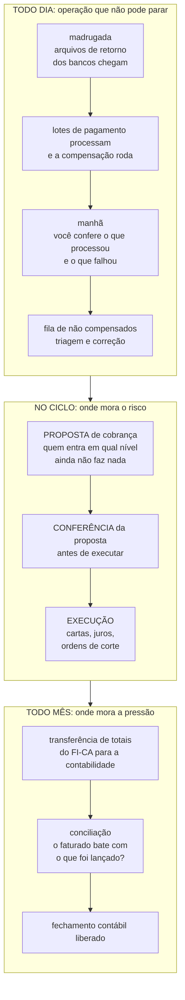
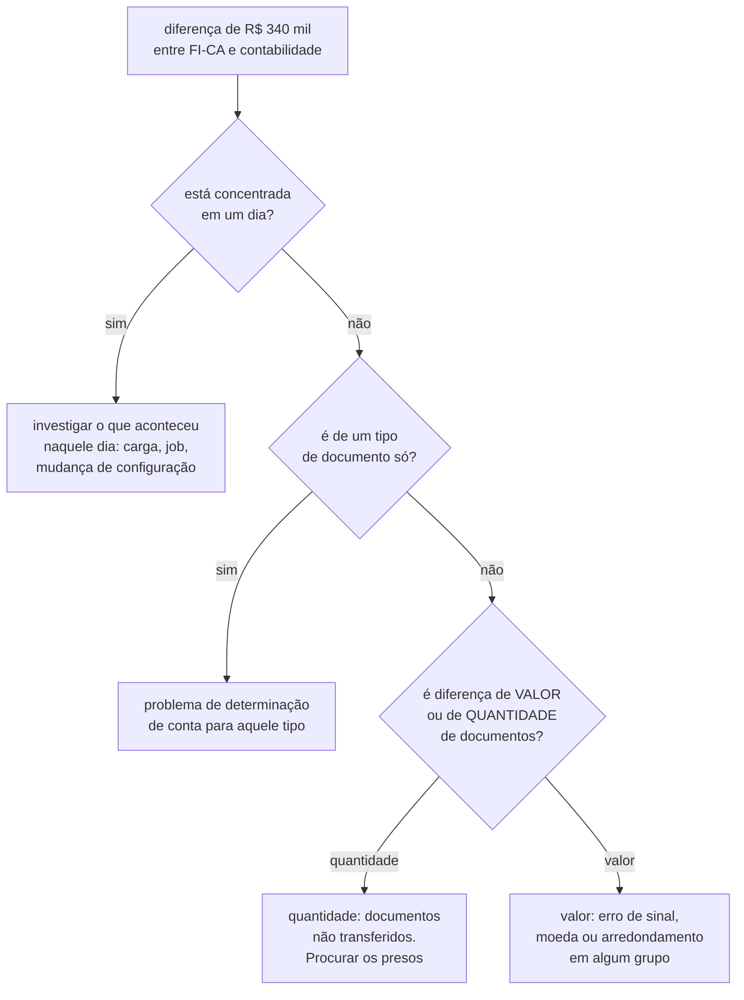
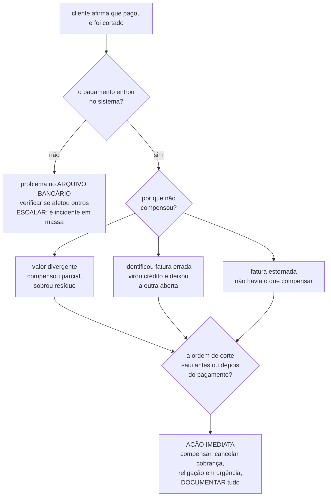

# FI-CA em detalhe
### O dia a dia do analista júnior de Finanças e Cobranças

> Aprofundamento de FI-CA, complemento do `00-NUCLEO.md`.
> A rotina descrita aqui é o padrão do setor, não necessariamente o desenho de
> um time específico.

---

## 1. O seu mandato

Em uma frase: **garantir que o que foi cobrado vire dinheiro, e que ninguém seja cobrado errado no caminho.**

Desdobrado em quatro responsabilidades:

1. O que o faturamento emitiu virou dívida corretamente lançada
2. O dinheiro que entrou foi casado com a dívida certa
3. A régua de cobrança rodou, e não pegou quem não devia pegar
4. No fim do mês, o FI-CA bate com a contabilidade

Repare que **nenhuma delas é sobre calcular valor**. Isso é do Faturamento. Você entra depois que o valor já existe.

---

## 2. O calendário, que é o que estrutura tudo

FI-CA é a área com o ritmo mais marcado do IS-U. Ele tem três frequências, e você vive nas três ao mesmo tempo.

**O diário é operação.** É a rotina que não pode parar.
**O do ciclo é risco.** É onde se corta gente, e onde um erro vira processo judicial.
**O mensal é pressão.** É onde a contabilidade inteira depende de você achar a diferença.

---

## 3. Um dia detalhado

Não é toda quarta que tem crise, mas a estrutura do dia é essa.

**8h50.** Você chega antes do resto do time, porque a madrugada já produziu o seu dia.

**9h00, o retrato da noite.** Cinco bancos mandaram arquivo de retorno. Quatro processaram limpo, 338 mil pagamentos entraram e compensaram. Um falhou. **Este é o primeiro número do dia, e ele define se hoje é um dia normal ou não.**

**9h15, o arquivo que falhou.** Você abre o log. O banco mudou uma posição no layout sem avisar. **42 mil pagamentos não entraram.**

Aqui está a parte que ninguém explica: isso não é um problema de 42 mil pagamentos. É um problema de **42 mil pessoas que pagaram e que amanhã aparecem como inadimplentes na proposta de cobrança.** Você tem hoje para resolver, ou elas entram na régua.

Você escala com o impacto quantificado, não com "o arquivo falhou". A frase que funciona é:

> *"Arquivo do banco X não processou por mudança de layout. 42 mil itens, R\$ 6,1 milhões. Entram na régua amanhã se não resolvermos hoje."*

Isso é o que faz alguém largar o que está fazendo.

**10h00, a fila dos não compensados.** Dos 338 mil que entraram, 2.900 não casaram com nenhuma partida. Você tria por causa:

| Causa | Volume | O que fazer |
|---|---|---|
| Valor menor que a fatura | 1.400 | Compensa parcial, sobra resíduo. Verificar se o resíduo entra na régua |
| Código de barras de fatura já paga | 800 | Vira crédito. Aplicar na fatura seguinte ou devolver |
| Valor maior que a fatura | 400 | Crédito em conta |
| Fatura estornada | 200 | Não há o que compensar. Analisar caso a caso |
| Sem identificação | 100 | Os difíceis. Buscar por valor e data |

> **A técnica central: agrupe antes de olhar.** Ninguém abre 2.900 casos. Você agrupa por causa, resolve em massa os grupos com regra clara, e reserva o tempo humano para os 100 difíceis.

**11h30, a proposta de cobrança.** Hoje é dia de rodar a régua. A proposta saiu com 84 mil contas elegíveis. **Antes de executar, você confere.** Esta meia hora é a mais importante do seu dia e a que mais protege a empresa:

- Tem alguém que pagou nas últimas 48 horas e a compensação ainda não rodou?
- Tem cliente com bloqueio de cobrança que a régua ignorou?
- Tem serviço essencial na lista de corte? Hospital, unidade de saúde, saneamento, segurança pública?
- Tem alguém com liminar judicial?
- O volume está compatível com o mês passado, ou saltou sem explicação?

> **Se o volume saltou, pare.** Salto de volume na régua quase sempre significa que algo a montante quebrou, e você está prestes a cobrar milhares de pessoas indevidamente.

**13h30, o chamado individual.** Atendimento escalou: cliente afirma que pagou e foi cortado.

Você abre a conta dele em `FPL9` e reconstrói. Encontra o pagamento de R\$ 214,00 em 12/07. Encontra a fatura de julho, R\$ 214,00, aberta. **O pagamento existe, a fatura existe, e não casaram.**

Olhando o detalhe: ele pagou com o código de barras da fatura de junho, que já havia sido quitada. O sistema aplicou o pagamento como crédito na conta e deixou julho aberto.

**Não é erro de sistema.** É comportamento do cliente somado a uma regra de compensação que não busca outra partida quando a identificada já está fechada.

Você compensa manualmente, cancela o corte, aciona religação em urgência, e **anota o padrão**. Porque se aconteceu com ele, aconteceu com outros.

**15h00, a análise que ninguém pediu.** Você roda uma extração para ver quantos casos iguais existem no mês. São 340. Isso deixa de ser um chamado e vira uma proposta de melhoria na regra de compensação. **É assim que júnior vira referência.**

**16h30, é dia 20.** Começa a conferência do fechamento. Você compara o total faturado no mês com o total lançado na contabilidade. **Diferença de R\$ 340 mil.** Você começa a caçar.

**17h50.** Achou: um grupo de documentos ficou preso na transferência por causa de uma conta contábil não determinada para um tipo novo de lançamento. Se você não achasse hoje, a contabilidade não fecharia.

---

## 4. O fechamento mensal

É o evento de maior pressão do calendário, e o mais parecido com o que você já viveu em planejamento de contrato.

**O que acontece.** O FI-CA precisa entregar para a contabilidade o resumo de tudo que aconteceu no período: faturamento, recebimento, juros, baixas, estornos. A contabilidade lança isso no razão. Se os dois lados não batem, **o mês não fecha**, e isso escala rápido, porque atinge o fechamento da empresa e não só o seu time.

**O seu papel como júnior.** Você não conduz o fechamento. Você é quem **caça a diferença**. E caçar diferença numa base de milhões de documentos é trabalho de eliminação sistemática:

**Por que isso é familiar.** É a mesma disciplina de fechar uma medição que não bate com o previsto. A pergunta é a mesma, o dado é outro.

---

## 5. Os chamados, com o passo a passo

### "Cliente pagou e foi cortado"
O mais grave que existe na área.

**Documente sempre.** Este tipo de caso pode virar processo judicial, e o registro do que você fez e quando é a defesa da empresa.

### "O saldo não bate com o que o cliente diz"
1. Reconstruir a linha do tempo: faturas emitidas, pagamentos, juros, multa, estornos
2. **Verificar parcelamento**, porque ele substitui as partidas originais e o cliente costuma somar as duas
3. Verificar estorno com reemissão, que aparece duas vezes para quem não sabe ler
4. Escrever a explicação **em português**, para o atendente repassar ao cliente

### "O lote de pagamento não processou"
1. O arquivo chegou? Está íntegro?
2. O layout mudou?
3. **Quantos itens e quanto valor estão parados?**
4. Escalar com o impacto quantificado, nunca só com "falhou"

### "Cliente com bloqueio entrou na régua"
1. O bloqueio existe? Está vigente na data em que a régua rodou?
2. Está no nível certo: conta contrato ou partida?
3. A execução rodou antes de o bloqueio ser criado?
4. **Este é sério:** significa que o mecanismo de proteção falhou, e pode ter pego outros. Trate como incidente em massa até provar o contrário

### "O fechamento não bate"
Ver a seção 4.

---

## 6. O que você toca no sistema

| Ferramenta | Uso |
|---|---|
| `FPL9` | **A sua transação principal.** A conta do cliente, com todas as partidas, abertas e compensadas. Você vai abrir isso dezenas de vezes por dia |
| `FPE1`&nbsp;/&nbsp;`FPE2`&nbsp;/&nbsp;`FPE3` | Criar, alterar e exibir documento FI-CA |
| `SE16N` | Extrair em massa. É aqui que a sua base de análise mora |
| `SM37` | Conferir se os jobs da noite rodaram, e como terminaram |
| `SLG1` | O log de aplicação, onde está o motivo real do erro |
| Família `FP0*` | Lotes de pagamento. **(confirmar códigos na documentação SAP)** |
| Família `FPV*` | Proposta e execução de cobrança. **(confirmar)** |

**As tabelas que viram o seu Excel:**

| Tabela | O que tem dentro |
|---|---|
| `DFKKOP` | **As partidas.** A tabela mais importante da sua vida |
| `DFKKKO` | Cabeçalho do documento FI-CA |
| `DFKKOPK` | Partidas de razão |
| `FKKVK` | Conta contrato |

---

## 7. A progressão

| Quando | O que você faz |
|---|---|
| **Primeira semana** | Acessos e documentação. Acompanhar alguém. Aprender a ler `FPL9` até conseguir contar a história financeira de um cliente só olhando a tela. Só exibição, nada de alteração |
| **Primeiro mês** | Chamados individuais. Triagem de não compensação. Você vira o primeiro nível de análise e aprende a agrupar antes de olhar caso a caso |
| **Primeiro trimestre** | Caçar diferença no fechamento. Conferir a proposta de cobrança antes do disparo. Parametrizar sob supervisão. Documentar os erros recorrentes que ninguém documentou |
| **Primeiro semestre** | A análise que ninguém pediu: causas de não compensação, funil da régua, percentual de autorregularização. É onde o seu perfil vira vantagem visível |

---

## 8. O que separa um júnior bom de um mediano

**Reconstruir e explicar.** Pegar uma conta bagunçada, reconstruir a história e explicar cada centavo para quem não é técnico. Parece básico e quase ninguém faz bem.

**Ver o padrão.** O mediano resolve 200 chamados. O bom percebe que 180 têm a mesma causa e ataca a causa.

**Quantificar ao escalar.** "Falhou" contra "42 mil itens, R\$ 6,1 milhões, entram na régua amanhã" são dois analistas diferentes.

**Desconfiar de si antes de desconfiar do sistema.** Divergência quase nunca é bug. É definição, data de corte, ou dado que você leu errado.

**Cuidado em produção.** Esta área mexe com dinheiro de gente de verdade. Compensação manual errada, estorno indevido, bloqueio removido sem checar. Um clique aqui tem consequência financeira e às vezes jurídica. **Na dúvida, pergunte antes.**

---

## 9. As armadilhas

| Armadilha | Por quê |
|---|---|
| Tratar cada chamado como único | Você afoga na fila e nunca resolve a causa |
| Executar a régua sem conferir a proposta | É o caminho mais curto para cortar quem pagou |
| Confundir FI-CA com contabilidade | Você vai procurar a fatura no lugar errado e concluir que sumiu |
| Ignorar resíduo pequeno | R\$ 3,40 em aberto pode manter alguém na régua de cobrança |
| Somar parcelamento com a dívida original | Conta dobrado. Erro clássico em análise de inadimplência |
| Não documentar o que fez | Módulo financeiro tem exigência de rastreabilidade, e o registro é a sua defesa |
| Mexer em produção "só para testar" | Não existe "só para testar" onde tem dinheiro de cliente |

---

## 10. Perguntas para fazer a quem já roda FI-CA

São as que separam quem leu a documentação de quem viu o processo rodar.

1. "Qual o percentual de compensação automática aqui, e quais as causas mais comuns dos que não compensam?"
2. "Como o sistema garante que cliente com liminar ou serviço essencial não entre na régua de corte?"
3. "Como é o calendário real de fechamento, e o que costuma dar errado nele?"
4. "A execução da régua é diária, semanal ou mensal? E quem confere a proposta antes do disparo?"
